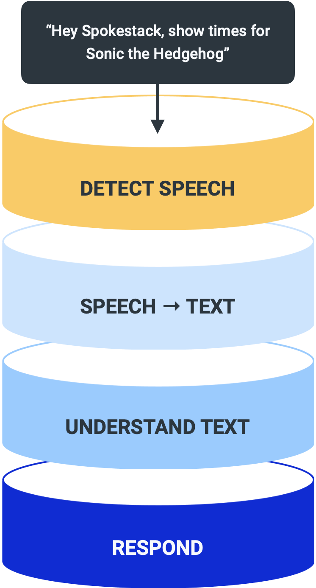

Spokestack's tagline, "Give your app a voice interface," has mainly focused on mobile apps since we launched in January. Today we're expanding the type of apps we can voice-enable to almost any project with the launch of [Spokestack Python](https://github.com/spokestack/spokestack-python). Want to try it out now? [Will Rice](https://twitter.com/_Will_Rice), who built the library, has written a tutorial **(LINK NEEDED)** for the "Minecraft Helper" example we developed for our [mobile platforms](https://www.spokestack.io/blog/porting-a-smart-speaker-voice-app-to-mobile-part-1).

Just as they do with our [iOS](https://github.com/spokestack/spokestack-ios), [Android](https://github.com/spokestack/spokestack-android), and [React Native voice libraries](https://github.com/spokestack/react-native-spokestack), developers can use Spokestack as a complete speech pipeline solution to talk to their customers. All you need to do to get started is [create a Spokestack account](https://www.spokestack.io/create) and get your API credentials. The same API that powers our mobile libraries also powers Spokestack Python. We want developers to be able to write once, talk everywhere using Spokestack.

You have everything you need to add a voice interface to any project.

As with all of our libraries, developers can create a [custom wakeword](https://www.spokestack.io/blog/wakewords-for-mobile-apps) and a text-to-speech voice that is unique to their brand and application. With the Spokestack Python library, the voice interface is less tied to a platform, opening up a number of application opportunities. 

Got an Alexa or Google Assistant app you want to set up as a kiosk? Now you can build one on a low-energy, small-form device such as a Raspberry Pi or [Tinker Board](https://www.asus.com/us/Single-Board-Computer/Tinker-Board/). Maybe you want to set up something on an old PC with a mic and a speaker. Simply [export your NLU model](https://www.spokestack.io/docs/Concepts/export), and you can do it!

Or maybe you want to build a voice bot companion for a game or social platform. Whatever your project, there are a ton of ways to add an independent voice interface, and you have complete creative freedom using Spokestack Python.

Over the next few weeks, Will is going to create video tutorials and demonstrations to show what you can do with Spokestack. We hope this will spark everyone's imagination and stir your thoughts about what is possible with a flexible speech pipeline that's customizable for any use case you can imagine. Be sure to follow us on [Twitter](http://www.twitter.com/spokestack) or [sign up for our newsletter](http://spokestack.substack.com) for stream announcements.

If you have any questions or feedback, please send us an [email](mailto:hello@spokestack.io). We look forward to seeing what you build!