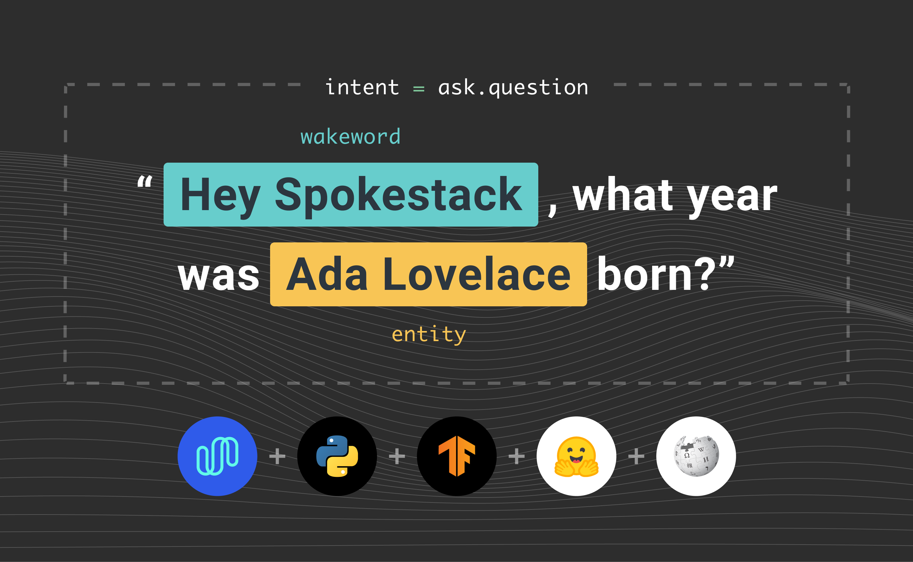

The ability to find information is a fundamental feature of the internet. Often, the information sought is the answer to a question. When it comes to answering a question about a specific entity, Wikipedia is a useful, accessible, resource. This tutorial will teach you how to use Spokestack and [Huggingface's Transformers](https://huggingface.co/transformers/index.html) library to build a voice interface for a question answering service using data from Wikipedia.

## Learning Objectives

By the end of this tutorial, you receive the following:

- The ability to give your app a voice with [Spokestack](https://www.spokestack.io/).
- A basic understanding of how to incorporate [Huggingface's Transformers](https://huggingface.co/transformers/index.html) with Spokestack.
- An interactive voice interface that allows you to answer questions from [Wikipedia](https://www.wikipedia.org/).

## Setting up the Project

First, let's make a directory to hold the project.

```bash
git clone https://github.com/spokestack/wikiqa-python
cd wikiqa-python
```

Now let's set up the python virtual environment. We use `pyenv` to manage virtual environments, but any virtual environment will work.

```bash
pyenv install 3.8.6
pyenv virtualenv 3.8.6 wikiqa
pyenv local wikiqa
```

Then the dependencies.

```bash
pip install -r requirements.txt
```

### TensorFlow

For this tutorial, we are using the full [tensorflow](http://tensorflow.org) package for a little more functionality than is included with the [TFLite Interpreter](https://www.tensorflow.org/lite/guide/python#install_just_the_tensorflow_lite_interpreter). If this is the first time you are installing `tensorflow` you should follow the [system-specific installation](https://www.tensorflow.org/install). For those who already have the ability to install via [pypi](https://pypi.org/) the following will install the library to your environment.

```bash
pip install tensorflow
```

### Transformers

In addition to TensorFlow, you will also need to install [HuggingFace's](https://huggingface.co/transformers/index.html) `transformers` library for the question answering model.

```bash
pip install transformers
```

## Speech Pipeline with Profiles

Profiles are preset configurations for our [Speech Pipeline](/docs/Python/speech-pipeline). For this tutorial, we will use the Spokestack wakeword and ASR profile. The wakeword model runs on device, and can be activated by saying "Hey, Spokestack". ASR is in the cloud though, so you will need to get your API credentials to use it. If you already have a free account, [log in](/login). If you do not, you will need to [create](/create) one. The credentials can be found in your [account settings](/account/settings). This is everything you need to speak to your app.

```python
from spokestack.profile.wakeword_asr import WakewordSpokestackASR

pipeline = WakewordSpokestackASR.create(
    KEY_ID, KEY_SECRET, model_dir="tflite"
)
pipeline.start()
```

## Natural Language Understanding (NLU)

Natural Language Understanding (NLU) is how we transform what the user says into action. For more explanation on the NLU see our [docs](/docs/Concepts/nlu). The NLU model for this project is already included in the GitHub repository. However, we will briefly discuss the model configuration in the next section.

```python
from spokestack.nlu.tflite import TFLiteNLU

nlu = TFLiteNLU("tflite")
```

### Model Configuration

We've included a pre-trained model, so you can follow along with this tutorial, but if you want to create your own, here's a quick introduction to writing NLU training data. See our [documentation](/docs/Concepts/nlu-training-data) for more information on our data format and how to train your own model. We are using a basic NLU template which includes intents like `greet`, `accept`, and `help`. In addition, we need a way to identify an entity in the user utterance to perform a Wikipedia search (more on this later). The name of this intent is `ask.question`, and the utterance templates are simple ways to ask a question. Naturally, these templates could be more complex and cover a wider variety of utterances, but for the purpose of this tutorial these will be enough.

```
[slots.subject]
type = "entity"

[generators.adjective]
type = "list"
values = ["long", "tall", "wide", "far"]

[utterances]
values = [
    "who is {subject}?",
    "what is {subject}?",
    "what is a {subject}?",
    "what is an {subject}?",
    "{subject}",
    "how {adjective} is the {subject}?,
    "how {adjective} is {subject}?
]
```

## Question Answering (QA)

For the QA model, we are using a [SQUAD](https://arxiv.org/abs/1606.05250)-style span detection method. The problem is framed as, “given this question and this context that contains the possible answer, identify the text span that contains the answer”. At this point, you most likely are thinking, "where do we get the context?". We will answer that in the next section.

### Context Retrieval

Earlier, we mentioned that we wanted to be able to identify entities in the user's utterance for a Wikipedia search. Context retrieval is the reason for this. Our QA model needs a context from which to draw the answer. Therefore, we will follow the assumption that the question is about a specific entity. For example, "What year was Ada Lovelace born?". From this utterance, we pull out the entity "Ada Lovelace" and do a search to retrieve the Wikipedia page. Then, we feed the entire Wikipedia page into the model as context for our question.

### Setting Up The Model

We are using a pre-trained [DistilBERT](https://huggingface.co/transformers/model_doc/distilbert.html) model, which is fine-tuned on the [SQUAD](https://arxiv.org/abs/1606.05250) dataset. The choice of model is based on the size, similarity of the fine-tuning task to our objective, and availability at the time of writing. The [collection](https://huggingface.co/models) of pre-trained models is always growing, so feel free to try any of the other models that were fine-tuned on a similar task. You will most likely find a model that works better than this basic one. We would love to hear about the one you discovered, or even better, trained!

```python
from transformers import AutoTokenizer, TFAutoModelForQuestionAnswering

tokenizer = AutoTokenizer.from_pretrained("distilbert-base-cased-distilled-squad")
model = TFAutoModelForQuestionAnswering.from_pretrained(
    "distilbert-base-cased-distilled-squad"
)
```

## Dialogue Manager

The dialogue manager for this project is a smart speaker-style interaction. A user asks a question, and the bot speaks the answer. The full example can be seen below. The process starts with retrieving the entity (person/place/thing) found in what the user said. Then, we take that entity and look up its page on Wikipedia. Next, we take the full text of the Wikipedia page and feed it, along with the question, to the QA model. The model gives us the location of the answer, which we use to grab the answer from the full text. Then, we return the answer in the form of a response. This setup is pretty simple and just meant to get you started. Definitely expand on this dialogue manager and conform it to your needs.

```python
"""
Simple QA dialogue manager
"""

import tensorflow as tf
from mediawiki import MediaWiki
from spokestack.nlu.result import Result
from spokestack.nlu.tflite import TFLiteNLU
from transformers import AutoTokenizer, TFAutoModelForQuestionAnswering


class DialogueManager:
    """ Simple Question Answering Dialogue Manager """

    def __init__(self, log_path: str, base_model: str) -> None:
        self._wiki = MediaWiki()
        self._nlu = TFLiteNLU(log_path)
        self._tokenizer = AutoTokenizer.from_pretrained(base_model)
        self._answerer = TFAutoModelForQuestionAnswering.from_pretrained(base_model)

    def __call__(self, utterance: str) -> str:
        result = self._nlu(utterance)
        if result.intent == "ask.question":
            return self._answer(result)
        elif result.intent == "greet":
            return self.greet()
        elif result.intent == "command.exit":
            return self.exit()
        elif result.intent == "request.help":
            return self.help()
        else:
            return self.fallback()

    def _answer(self, result: Result) -> str:
        if result.slots:
            # get the tagged entity for page search
            entity = result.slots.get("entity").get("raw_value")
            # perform the search to find the wikipedia page
            entity = self._wiki.search(entity)[0]
            # get the page content to feed as context to the qa model
            passage = self._wiki.page(entity, auto_suggest=False).content
            # prepare qa model inputs
            inputs = self._tokenizer(
                result.utterance,
                passage,
                return_tensors="tf",
                padding=True,
                truncation=True,
            )
            # compute answer span
            start_scores, end_scores = self._answerer(inputs)
            start, end = tf.argmax(start_scores, -1)[0], tf.argmax(end_scores, -1)[0]
            # prepare the passage ids for slicing
            tokens = self._tokenizer.convert_ids_to_tokens(
                (inputs["input_ids"].numpy()[0])
            )
            # retrieve only the answer from the passage
            answer = self._tokenizer.convert_tokens_to_string(tokens[start : end + 1])
            return answer
        return "I don't have an answer for that"

    @staticmethod
    def greet() -> str:
        return "Hello, Ask me anything"

    @staticmethod
    def exit() -> str:
        return "Goodbye"

    @staticmethod
    def fallback() -> str:
        return (
            "I'm having trouble understanding your request, could you please "
            "repeat it"
        )

    @staticmethod
    def help() -> str:
        return "Ask a question like, how long is the amazon river?"
```

OK, now we have our response from the dialogue manager. The next question on your mind is probably "how do we give it a voice?". Check out the following section for how to set up Spokestack's text to speech service.

## Text to Speech (TTS)

Now, let's give the app a voice. Similar to the profile section, you will need your Spokestack API keys. We offer a `TextToSpeechManager` class which requires a TTS client and an output source. In most cases, the `PyAudioOuput` class should work. It uses the default system speaker.

```python
manager = TextToSpeechManager(TextToSpeechClient(KEY_ID, KEY_SECRET), PyAudioOutput())
manager.synthesize("hello, world", "text", "demo-male")
```

Now that we have given our bot a voice, we can put everything together. At this point, you are just one section away from a voice interface that allows you to get answers to simple questions. Let's move on to the complete working example.

## Putting it All Together

We have all the modules set up. Now we need to add the logic that will respond to events in the conversation.
For this, we use our [Pipeline Events](/docs/Python/speech-pipeline). Pipeline Events are simply events that occur while the pipeline is running. To use them, you decorate functions with an event decorator. Most applications will want an event handler that does something when speech is recognized. For ours, we want to process the question and play the response. This is defined in the `on_recognize` handler. The function we are using for this example can be seen below. For more information on the included events take a look [here](/docs/Python/speech-pipeline#speech-event-handlers).

```python
@pipeline.event
def on_recognize(context):
    pipeline.pause()
    answer = dialogue_manager(context.transcript)
    manager.synthesize(answer, "text", "demo-male")
    pipeline.resume()


manager.synthesize(dialogue_manager.greet(), "text", "demo-male")
pipeline.start()
pipeline.run()
```

That pretty much wraps it up! You should now be able to ask some questions, and it will (hopefully) be able to find the right answer. I hope you found this tutorial useful, and thanks for taking the time to read it!

## Contact Us

If you have any questions while getting this set up we have a [forum](https://forum.spokestack.io/), or you can open an issue on [GitHub](https://github.com/spokestack/spokestack-python/issues). In addition, I am more than happy to help if you want to reach out to me personally via [email](mailto:will@spokestack.io) or [Twitter](https://twitter.com/_Will_Rice).
