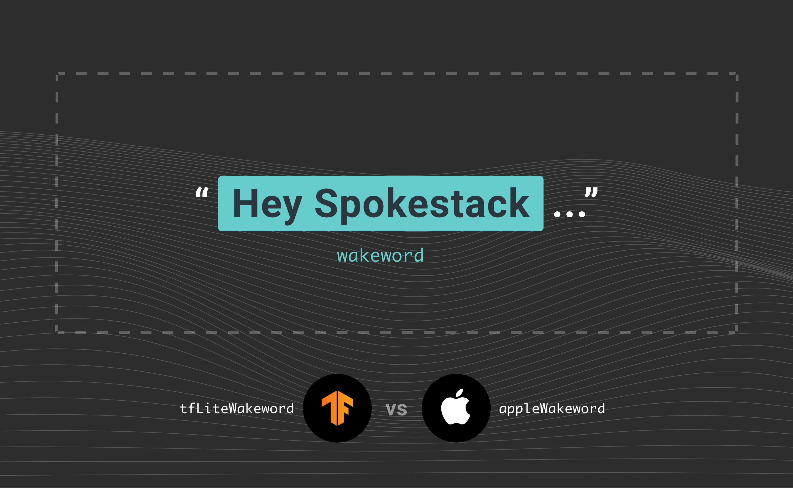

Spokestack offers two wake word services in iOS: `appleWakeword` and `tfLiteWakeword`. Which should you use?

The answer, of course, is up to you! Spokestack always gives you options, because one size does not fit everyone, and because, like you, we hate vendor lock-in.

## Wait, there's a wake word?

Indeed! If you want your app to be controllable purely by voice, you need a wake word — a word (or short phrase) that tells your app “the next thing the user says is meant for you”. The wake word detection component in Spokestack is responsible for detecting any of a user-defined set of keyword phrases in [soft real time](https://en.wikipedia.org/wiki/Real-time_computing#Criteria_for_real-time_computing). Once detected, the Spokestack pipeline activates, providing you with an activation event and triggering the configured speech recognition service. The accuracy, speed, and flexibility of wake word detection depends on which service you configure.

`youtube: [Wake words for iOS apps](https://www.youtube.com/watch?v=3qKJMrkbZA8)`

## Ok, so which one should I use?

In general, `tfLiteWakeword` will have better accuracy and faster activation. `appleWakeword` is intended for quick demos where you want to try out different wake words for UX research and not have the overhead of having to build a TensorFlow model for every option. Let's discuss the guidelines for using them in more detail by asking two questions.

## What wake word do we want our app to use?

What wake word do we want our app to use? Tricky question! Answering the question means [UX research](/blog/user-research-for-voice-experiences), brand identity discussions, and even linguistics consulting. Of course Spokestack is here to help with that.

### Prefer

Spokestack's `appleWakeword` uses Apple's free on-device ASR to transcribe all speech heard while the Spokestack pipeline is running, and then filters that speech for the wake word(s) that you specify in the `SpeechConfiguration.wakewords` configuration. This allows you to have a tight testing cycle when trying out the UX of different wake words. Boss doesn't like your favorite "HAL" wake word idea? Just change a single line and try out their "GUNTER" idea. Just want your app to get an event when a user says "take a selfie", or even allow your users to choose their own wake words? No need to muck with [fancy embedded computing models](https://voicebot.ai/2020/05/29/new-voice-selfie-app-takes-photos-using-custom-phrases/) — just change one line of code!

### Avoid

`appleWakeword` should not be used in any published app, both because its performance will always be slower than `tfLiteWakeword` and because it depends on running constant ASR over all speech while the pipeline is running, which is both a privacy concern and an overuse of resources for the actual task.

## How do I distribute my app with a fast, accurate, efficient, on-device wake word?

Spokestack's `tfLiteWakeword` fits the bill for you! You'll gain fast, accurate, efficient, wake word activation that runs entirely on-device. It features a state-of-the-art machine learning pipeline using attention-based models; they operate continuously, each feeding output into the next, for both efficiency and accuracy.

To get you started, Spokestack provides pretrained TensorFlow models that enable on-device wake word detection. These free models, however, only recognize the word “Spokestack”; in order to have your app respond to a different word or phrase, you’ll need your own custom models.

### Prefer

[Work with us to develop a custom TensorFlow model](/docs/concepts/wakeword-models), and then distribute that model with your app configured to use `tfLiteWakeword`. When testing your app using `tfLiteWakeword`, be sure to consult the [Spokestack pipeline model hyperparameter configuration guide](/docs/concepts/pipeline-configuration).

### Avoid

Don't use `tfLiteWakeword` without a TensorFlow model of the wake word you want to use, or when you don't know what wake word you want to activate your app.
