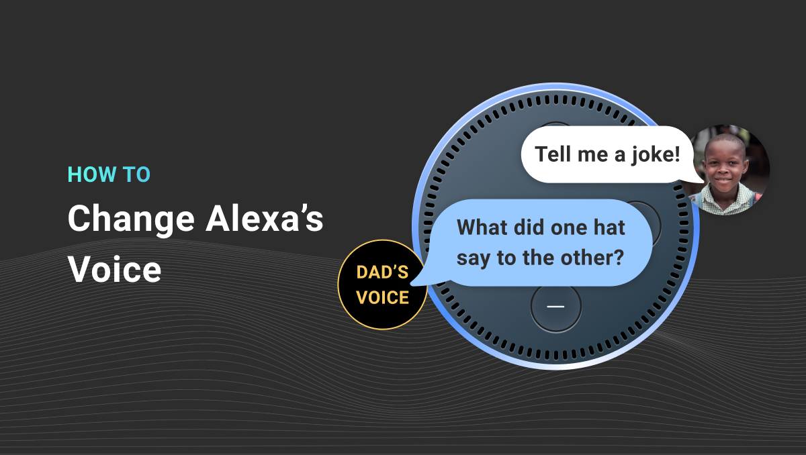

At Spokestack, one of our core goals is to make it possible for every mobile app or voice skill to have its own unique audible voice. Amazon and Google make it easy to use their text-to-speech services, but then your skill (/action) ends up sounding like all the rest. If you've ever wondered how to change Alexa's voice, we have an [article on Voice Tech Podcast](https://voicetechpodcast.com/articles/development/how-to-change-alexas-voice/) just for you.

It'll give you some background on what's required to actually replace the system voice and walk you step by step through the use of [a low-code example in Python](https://github.com/spokestack/alexa-custom-tts) to set up a skill of your own. You can use a free Spokestack account to try everything out, and if you agree that your skill should stand out from the crowd, you can upgrade to [the Maker tier](/pricing#maker) and create a completely new voice that only you can use.

The whole process is a very low-effort way to see the benefits of a Spokestack account in action, so head over to [Voice Tech Podcast](https://voicetechpodcast.com/articles/development/how-to-change-alexas-voice/) for the whole article!
