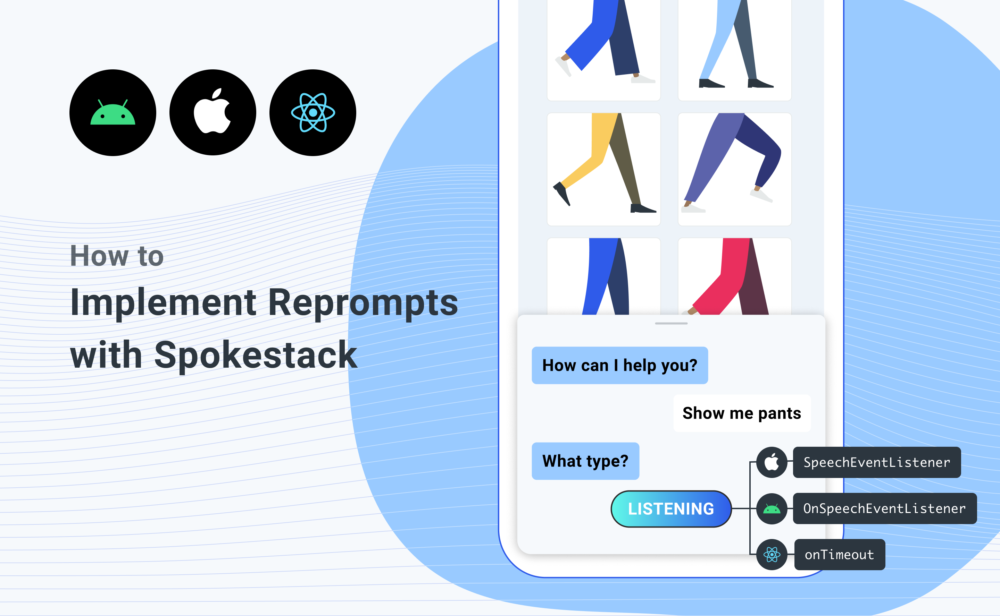

Reprompts are a convenient feature provided by most smart speaker platforms. In plain English, a reprompt is a special message given to the user under the following circumstances:

1. The app requests information from the user, leaving the mic open to listen for the answer
1. The user remains silent for a pre-set length of time

Platforms differ in the number of reprompts they allow an app to give the user before the platform itself takes control and shuts off the mic — some only allow one, some will give you the chance to deliver up to four different prompts before finally giving up on the user. With Spokestack, you can choose that number for yourself. In an app where the user is expected to switch back and forth between voice and gesture input frequently, reprompts might be inappropriate altogether, but in one that's designed to be used hands-free, you might want to give the user a couple chances to answer a question.

In Spokestack, reprompting is a matter of responding to the timeout event sent by the speech pipeline. In Android, this event is received by the `OnSpeechEventListener`, in Swift by the `SpeechEventListener`, or in React Native by attaching a listener to the `onTimeout` event.

The specifics will vary based on how you've set up your app, but the basic pseudocode for the process would be:

```js
if event is TIMEOUT:
  if dialog_manager.is_waiting_for_response():
    reprompt = get_next_reprompt()
    if reprompt:
      Spokestack.synthesize(reprompt)
      // re-open the microphone to listen for the
      // answer again, but don't do it here since
      // you don't want to listen to the reprompt itself
```

And that's it! For the reprompts, at least. Configuring the dialog manager to know when reprompts are appropriate is left as an exercise to the reader. As always, if you have any issues, don't hesitate to reach out via [Discourse](https://forum.spokestack.io/), [Stack Overflow](https://stackoverflow.com/questions/tagged/spokestack), or a [GitHub](https://github.com/spokestack) issue.
