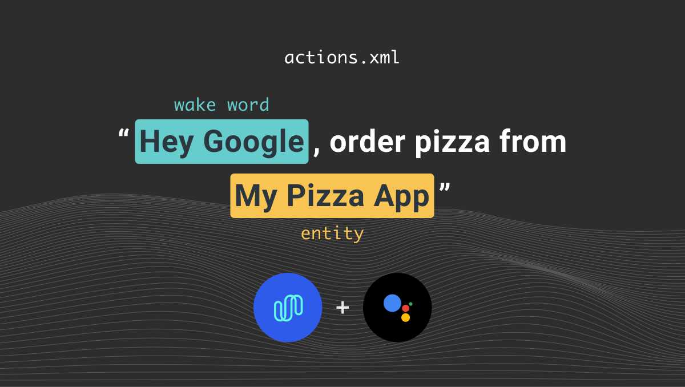

_This tutorial is part of a series:_

- [Part 1](/blog/integrating-spokestack-google-app-actions/part-1): Working with Google App Actions
- [Part 2](/blog/integrating-spokestack-google-app-actions/part-2): Adding your own voice experience with Spokestack
- **Part 3** (_You are here!_): Using Spokestack Tray to add a voice UI

---

Now that we know what we need to get started with voice control, both on Google's end and in our app, we'll polish our user experience a bit by adding visual elements to give the user more feedback about what the app is hearing and saying. With the changes we'll make in this tutorial, an interaction with Google Assistant will look like this:


To follow along, run `git checkout spokestack-tray` in your copy of the [sample repository](https://github.com/spokestack/app-actions-example). Since this tutorial involves changes to the activities we've already introduced, we've made them on a separate branch for easy comparison to the "headless" version of Spokestack.

## The why and how of Tray

As we've seen in other tutorials, you can add voice control to your app using just the [Spokestack library](https://github.com/spokestack/spokestack-android). [Spokestack Tray](https://github.com/spokestack/spokestack-tray-android) exists to help the user visualize their voice interactions without you having to build an entire UI for them from scratch. It includes a microphone button used to activate ASR without the use of a wake word, visual feedback while ASR is active, and a chat-like interface that displays the conversation between user and app.

Let's walk through the process of dropping it into our project, starting with the changes to `build.gradle`. Since the Tray exists to mediate your users' interaction with Spokestack, it bundles the dependencies necessary for that. That means we can replace all our Spokestack-related dependencies with the following:

```groovy
    implementation 'io.spokestack:tray:%ANDROID_TRAY_VERSION'
```

Continuing with the declarative parts of the project, Tray is implemented as a `Fragemnt`, so each `Activity` that wants to include it will want to add a few lines to its layout XML:

```xml
    <!-- nested in the main layout, after other views/sublayouts -->

    <include
        android:id="@+id/tray_fragment"
        layout="@layout/spokestack_tray_fragment"
        />
```

This will add a nested `ConstraintLayout` containing the `SpokestackTray` fragment into your layout. If you'd rather manage the layout XML yourself, take a look at [the layout file](https://github.com/spokestack/spokestack-tray-android/blob/main/SpokestackTray/src/main/res/layout/spokestack_tray_fragment.xml) we're including. You'll want to use the same tag for the fragment as it does, as it's important elsewhere.

Note also the `clipChildren` attribute on the parent layout. Depending on how your app is set up, you might also need to add this to any layouts serving as parents to the tray fragment. Our sample app does this in all its activities.

## On to the fun stuff!

That takes care of the setup, so let's move on to the code from [part 2](/blog/integrating-spokestack-google-app-actions/part-2) that we'll need to change. Spoiler alert: Thanks to delegating management duties to Spokestack Tray, we'll be deleting more than we add, resulting in a much simpler developer experience!

First, the `Voice` class goes away entirely — all `Spokestack` interaction goes through Spokestack Tray.

`VoiceActivity` gets a new parent class, the `TrayActivity` convenience class, which inherits from `AppCompatActivity` and deals with some Android platform unpleasantness related to `Fragment` construction. We've moved our main `Spokestack` configuration (now configuration for the Tray, which is similar) from `Voice` to `VoiceActivity` so we can provide it to `TrayActivity`. This configuration includes URLs instead of paths for wake word and NLU files since the Tray downloads them automatically; this means that our app bundle can be smaller, and we don't have to write the download code.

We've also taken the opportunity to provide a fallback voice response that'll be available to all subclasses:

```kotlin
fun fallbackPrompt(): VoicePrompt {
  return VoicePrompt(
    "Sorry, I didn't understand. Please try again.",
    expectFollowup = true
  )
}
```

We'll be using this fallback a lot, since we haven't built out a full voice experience for this sample. Everything else that was in that class dealt with managing Spokestack, so it just goes away. Feels good, doesn't it?

Next, let's look at `SearchActivity` to see how we deal with a voice command that can come from either Google or Spokestack:

```kotlin
private fun setUiFromIntent(data: Uri?, fromTray: Boolean = false) {
  data?.getQueryParameter("item")?.let {
    runOnUiThread {
      binding.searchContent.text = it
    }

    // `fromTray` is our cue for whether the command originally came from
    // Spokestack Tray or Google Assistant. If it's the former, the Tray
    // will automatically display and play the response; if the latter,
    // we'll need to explicitly respond.
    if (!fromTray) {
      tray.say(response(it))
    }
  }
}
```

The comment there reveals our secret. If the user opens this activity with a voice command from somewhere else in the app or from Google Assistant, we generate a response and pass it through Tray using the `say` method. If `SearchActivity` is active when the voice command is received, it can set `fromTray` to true and generate the response elsewhere.

That's as good a segue as any to talk about the other notable change in our activities — the listener. We're converting all our nested `SpokestackAdapter`s to `SpokestackTrayListener`s, which doesn't change much in our case because our sample app was only interested in NLU events to begin with. Our `nluResult` handlers become `onClassification` handlers, and now they're expected to return a response for the Tray to display and read.

We won't add any new logic to smooth the voice experience here other than supplying an error message. The message itself comes from `VoiceActivity` and plays any time we can't recognize a search request for a specific item. The only real change to the listener method, then, is the return:

```kotlin
return if (item != null) {
  response(item)
} else {
  fallbackPrompt()
}
```

## Conclusion

Just like that, we've gone from a cool-but-confusing "headless" voice experience to a UI-supported voice interface that puts the user in control and removes code from our codebase. It's a win-win. A quick checklist for integrating Spokestack Tray in your app:

- &#9989; add/update dependency
- &#9989; `include` fragment layout in activity XML
- &#9989; subclass `TrayActivity` in activities that include the fragment
- &#9989; supply a `TrayConfig` suited to your app
- &#9989; implement `SpokestackTrayListener` and supply appropriate responses in `onClassification`
