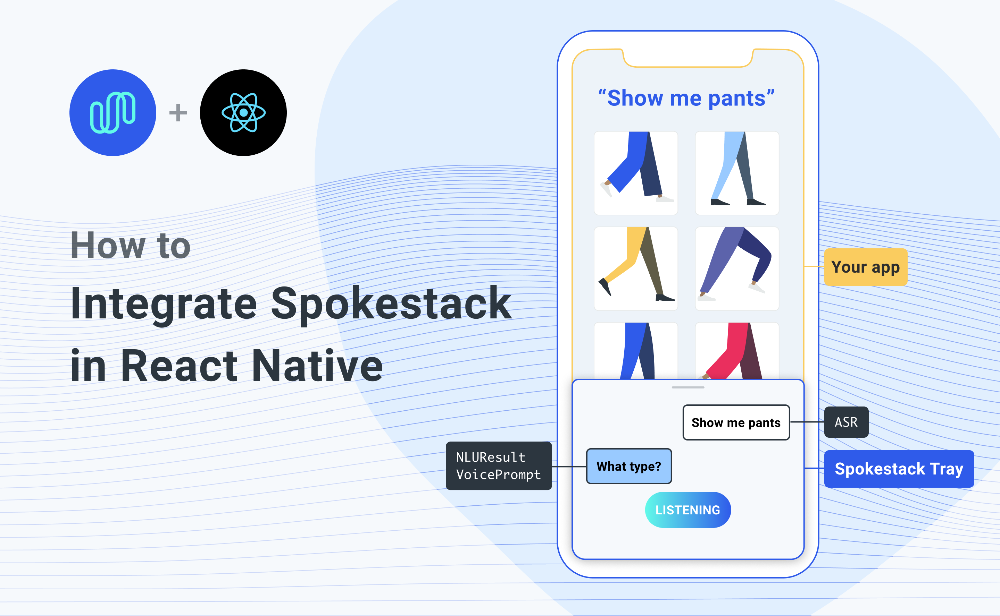

Not long ago, adding voice to any mobile app was not only time-consuming, but difficult and convoluted. This was especially true when adding voice experiences on multiple platforms, as might be the case when using React Native. Our mission at Spokestack is to make it as easy as possible to make your apps fully voice-enabled.

After building the services needed to make voice interaction work, including [Wakeword](/docs/Concepts/wakeword-models), [Speech Recognition](/docs/Concepts/asr), [Natural Language Understanding](/docs/Concepts/nlu), and [Text-to-speech](/docs/Concepts/tts), we started working on ways users could integrate these services without having to completely rewrite their applications.

Introducing [react-native-spokestack-tray](https://github.com/spokestack/react-native-spokestack-tray)!


[react-native-spokestack-tray](https://github.com/spokestack/react-native-spokestack-tray) is a React Native component that is designed to work in any application, regardless of its layout or navigation. It uses multiple existing React Native plugins, including [react-native-spokestack](https://github.com/spokestack/react-native-spokestack), to add voice experiences. With **on-device** wakeword, ASR, and NLU, the tray's `silent` mode works completely offline–TTS is the only service that requires a network.

With a few required props (and [lots of optional ones](https://github.com/spokestack/react-native-spokestack-tray#spokestacktray--component-props)), you can start building a customizable voice experience without the hassle that usually comes with listening for a wakeword, working with a microphone, or playing audio in iOS and Android.

This tutorial will guide you through the process of installing `react-native-spokestack-tray` as well as using the `<SpokestackTray />` component to respond to user intents. We won't go through the process of [setting up a new React Native project](https://reactnative.dev/docs/environment-setup), but be sure to use the React Native CLI path and not expo.

## Installation

First, install the dependencies. Here's a one-liner to install `react-native-spokestack-tray` and its peer dependencies.

```bash
npm install react-native-spokestack-tray react-native-spokestack @react-native-community/async-storage @react-native-community/netinfo react-native-video rn-fetch-blob react-native-haptic-feedback react-native-linear-gradient react-native-permissions
```

If you're wondering why these dependencies are needed, we've listed all of their purposes [in the tray's README](https://github.com/spokestack/react-native-spokestack-tray#each-dependency-by-its-usage).

Now that you have all of the node modules, we need to update some native files. We'll go through each of them by platform.

## iOS installation

### Edit Podfile

Our main dependency (react-native-spokestack) makes use of relatively new APIs only available in iOS 13+. Make sure to set your deployment target to iOS 13 at the top of your Podfile:

```ruby
platform :ios, '13.0'
```

We use [react-native-permissions](https://github.com/react-native-community/react-native-permissions) to check and request the Microphone permission (iOS and Android) and the Speech Recognition permission (iOS only). This library separates each permission into its own pod to avoid inflating your app with code you don't use. Add the following pods to your Podfile:

```ruby
target 'SpokestackTrayExample' do
  # ...
  permissions_path = '../node_modules/react-native-permissions/ios'
  pod 'Permission-Microphone', :path => "#{permissions_path}/Microphone.podspec"
  pod 'Permission-SpeechRecognition', :path => "#{permissions_path}/SpeechRecognition.podspec"
```

We need to use `use_frameworks!` in our Podfile because a couple of our dependencies are written using Swift.

```ruby
target 'SpokestackTrayExample' do
  use_frameworks!
  #...
```

For the time being, `use_frameworks!` does not work with Flipper, so we also need to disable Flipper. Remove any Flipper-related lines in your Podfile. In React Native 0.63.2, they look like this:

```ruby
  # X Remove or comment out these lines X
  use_flipper!
  post_install do |installer|
    flipper_post_install(installer)
  end
  # XX
```

Remove your existing Podfile.lock and Pods folder to ensure no conflicts, then install the pods:

```bash
$ npx pod-install
```

Refer to the [Podfile in our example](https://github.com/spokestack/react-native-spokestack-tray/blob/develop/example/ios/Podfile) for a working Podfile.

### Edit Info.plist

Add the following to your Info.plist to enable permissions. In XCode, also ensure your iOS deployment target is set to 13.0.

```xml
<key>NSMicrophoneUsageDescription</key>
<string>This app uses the microphone to hear voice commands</string>
<key>NSSpeechRecognitionUsageDescription</key>
<string>This app uses speech recognition to process voice commands</string>
```

### Edit AppDelegate.m

#### Add AVFoundation to imports

```objc
#import <AVFoundation/AVFoundation.h>
```

#### AudioSession category

Set the AudioSession category to enable microphone input and play from the speaker by default. This also enables input and playback over bluetooth.

```objc
- (BOOL)application:(UIApplication *)application didFinishLaunchingWithOptions:(NSDictionary *)launchOptions
{
  AVAudioSession *session = [AVAudioSession sharedInstance];
  [session setCategory:AVAudioSessionCategoryPlayAndRecord
     mode:AVAudioSessionModeDefault
  options:AVAudioSessionCategoryOptionDefaultToSpeaker | AVAudioSessionCategoryOptionAllowAirPlay | AVAudioSessionCategoryOptionAllowBluetoothA2DP | AVAudioSessionCategoryOptionAllowBluetooth
    error:nil];
  [session setActive:YES error:nil];

  // ...
```

#### Remove Flipper

While Flipper works on fixing their pod for `use_frameworks!`, we must disable Flipper. We already removed the Flipper dependencies from Pods above, but there remains some code in the AppDelegate.m that imports Flipper. There are two ways to fix this.

1. You can disable Flipper imports without removing any code from the AppDelegate. To do this, open your xcworkspace file in XCode. Go to your target, then Build Settings, search for "C Flags", remove `-DFB_SONARKIT_ENABLED=1` from flags.
1. Remove all Flipper-related code from your AppDelegate.m.

In our [example app](https://github.com/spokestack/react-native-spokestack-tray/tree/develop/example), we've done option 1 and left in the Flipper code in case they get it working in the future and we can add it back.

## Android installation

### Edit AndroidManifest.xml

```xml
    <!-- For TTS -->
    <uses-permission android:name="android.permission.INTERNET" />
    <!-- For wakeword and ASR -->
    <uses-permission android:name="android.permission.RECORD_AUDIO" />
```

### Edit app/build.gradle

Add the following lines:

```java
android {
    // ...
    defaultConfig {
        // ...
        multiDexEnabled true
    }
    // ...
    packagingOptions {
        exclude 'META-INF/INDEX.LIST'
        exclude 'META-INF/DEPENDENCIES'
    }
}
```

## Usage

`youtube: [Build your own voice interface to talk directly to your customers](https://www.youtube.com/watch?v=AvhQ6-9nCrQ)`

The [react-native-spokestack-tray example app](https://github.com/spokestack/react-native-spokestack-tray/tree/develop/example) uses the "Spokestack" wakeword and [sample Minecraft NLU models](/blog/porting-the-alexa-minecraft-skill-to-ios-using-spokestack).

In this example, the following code is used to add the `<SpokestackTray />` component:

```jsx
<SpokestackTray
  clientId={process.env.SPOKESTACK_CLIENT_ID}
  clientSecret={process.env.SPOKESTACK_CLIENT_SECRET}
  handleIntent={handleIntent}
  nluModelUrls={{
    nlu:
      'https://d3dmqd7cy685il.cloudfront.net/nlu/production/shared/XtASJqxkO6UwefOzia-he2gnIMcBnR2UCF-VyaIy-OI/nlu.tflite',
    vocab:
      'https://d3dmqd7cy685il.cloudfront.net/nlu/production/shared/XtASJqxkO6UwefOzia-he2gnIMcBnR2UCF-VyaIy-OI/vocab.txt',
    metadata:
      'https://d3dmqd7cy685il.cloudfront.net/nlu/production/shared/XtASJqxkO6UwefOzia-he2gnIMcBnR2UCF-VyaIy-OI/metadata.json'
  }}
/>
```

### `clientId` and `clientSecret`

The `clientId` and `clientSecret` props are where you pass your API tokens generated in your Spokestack account. First, [create a free account](/create). Then, [generate a token](/account/settings#api) on the account settings page. Don't worry, there's no hidden subscription.

Rather than hardcoding these values, we recommend saving them in your environment on your local machine and in CI for deployments. Once they're saved, run the React Native packager in a new terminal and start the app using `npm run ios` or `npm run android -- --device` (note that Android requires [a real device](https://reactnative.dev/docs/running-on-device) for ASR to work).

### `nluModelUrls`

These URLs point to the sample Minecraft NLU models files we have hosted on a CDN, which are downloaded automatically by `SpokestackTray` the first time the app launches (and only the first time). The files are then saved to the app's cache for future use so they only need to be downloaded once. NLU models can vary drastically in size, and we thought it better not to include them in the app bundles, but instead load them lazily.

At this point, you may be wondering what an NLU does. While Automatic Speech Recognition provides us with a way to process speech into text, that text is rarely enough to figure out what the user wants the app to do. Natural Language Understanding (NLU) is the next step to process the text into what voice platforms call "intents".

A good example is searching with voice. If your app has just said, "What would you like to search for?" and the user says, "Bananas", you can be reasonably sure that the user means for the app to search for bananas without the help of an NLU.

But if the user initiated the interaction and said, "Search for bananas", the NLU can parse that statement into an intent (e.g. "search") with variables (e.g. "bananas"). If you were only using ASR, you'd probably end up searching for the whole sentence, "search for bananas", rather than just "bananas", which may yield different results. For more information on NLU in Spokestack, please check out [our guide](/docs/Concepts/nlu). If you've already built an NLU model in Alexa, Dialogflow, or Jovo, check out [our guide on exporting existing NLU models from other platforms](/docs/integrations/export).

### `handleIntent`

So, intents are commands for the app based on what the user said. Now that you know how you get intents, it's your responsibility to respond to those intents. There are two questions to answer for any given intent:

1. What should the app say in response to the user? This is the return value of `handleIntent` and is always required.
1. Should the app update the UI? Note that not all intents will need to make UI changes.

In the voice search example, if the user has just searched for "bananas", the answer to question #1 might be to say, "Here are your search results." The answer to question #2 would probably be to show the search results. Remember that the NLU doesn't do the search for you; it just tells you the proper search terms.

These answers could be written like this...

<!-- prettier-ignore -->
```ts
function handleIntent(
  intent: string,
  slots?: any,
  utterance?: string
) {
  if (intent === 'search') {

    // Search for recipes with "bananas"
    const results = searchService.search(
      slots.ingredient
    )

    // Show the results
    navigation.navigate('SearchResults', {
      results
    })

    // Return a response
    return {
      prompt: 'Here are your search results.',
      node: 'search_results'
    }
  }
}
```

The `prompt` will then be synthesized using Spokestack's TTS service. It then gets played using the device's native audio player (unless the tray is in `silent` mode).

The `node` property is metadata to help you track conversation state, and the value is completely up to you. The only reason `SpokestackTray` needs it is to determine whether to listen again after the prompt has been said.

If the node is specified in the [`exitNodes`](https://github.com/spokestack/react-native-spokestack-tray#optional-exitnodes) prop, the conversation will stop and `SpokestackTray` will close.

If the `node` is not an exit node, `SpokestackTray` will stay open and listen to the user again, and the process will repeat.

## Conclusion

Hopefully, we've given you a glimpse into just how powerful `react-native-spokestack-tray` can be. Add the `SpokestackTray` component to your React Native app to start building elegant conversational user experiences.

For complete documentation, check out [react-native-spokestack-tray on GitHub](https://github.com/spokestack/react-native-spokestack-tray).

For support, we [offer multiple support channels](/support) to help you get started.
