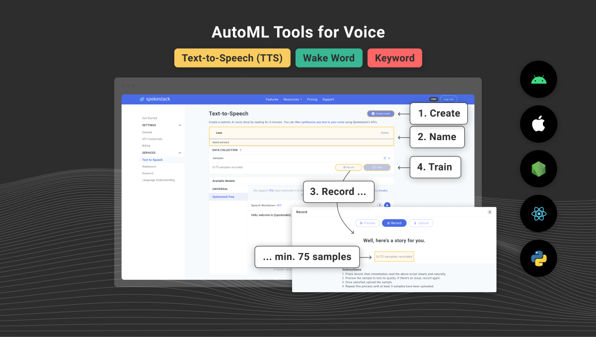

Spokestack exists to help put voice into software because voice is a humane way to interface with software and because software needs better, more accessible tools to utilize voice.

[Spokestack Maker](/account/upgrade) introduces sophisticated machine learning tools for voice to a new audience of prototypers, enthusiasts, and makers. Create, train, distribute, and use state-of-the-art personal wake word, keyword, and text-to-speech (TTS) models — with _your_ own voice.

Voice AI is a difficult field, full of papers with irreproducible results, hidden pitfalls, and undocumented code. You can end up spending all day in Jupyter notebooks babysitting training jobs instead of building your killer app. We know, we’ve done it before! [Spokestack Maker](/account/upgrade) turns voice into just another interface developers utilize—like a mouse & keyboard or a touchscreen—to interact with users.

Spokestack already offers powerful, industry-leading libraries for utilizing voice in [Python](/docs/python/getting-started), [React Native](/docs/react-native/getting-started), [Android](/docs/android/getting-started), and [iOS](/docs/ios/getting-started). With [Spokestack Maker](/account/settings#billing), that voice becomes personal and customizable, utilizing state of the art self-service AutoML technology.

With [Spokestack Maker](/account/upgrade), you have the power of three new tools for training your own [wake word](/features/wake-word), [keyword](/features/keyword), and [TTS](/features/tts) models using data you record yourself. You'll still have access to the same [NLU](/features/nlu) model trainer and TTS showcase available to all existing free accounts.

Want to test drive cutting-edge machine learning features like keyword recognition, wake word activation, and custom AI voices without breaking the bank? [Spokestack Maker](/account/upgrade) brings this enterprise-level technology to the creator market for the first time.

[Spokestack's Maker subscription pricing](/pricing) is tailored for two audiences: hobbyists who want to personalize their projects and developers who want to prototype a project as realistically as possible before committing to training a universal wake word model or studio-quality TTS voice.

You'll be able to download your personal models, train and retrain your personal models and enjoy API access your personal TTS voice as long as your Maker subscription is active. If you decide you'd like to take it to the next level and make a universal wake word/keyword model or a studio-quality TTS voice, just [let us know](mailto:hello@spokestack.io?subject=I want to know more about Spokestack's Universal voice models)!
