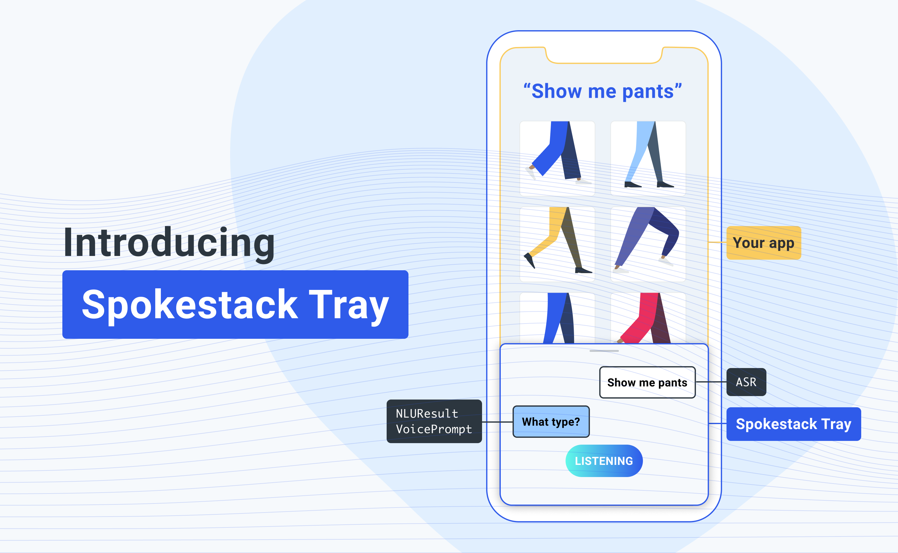

Today we are excited to announce our latest developer feature: Spokestack Tray, a mobile library that lets developers easily add a voice interface to their existing app through a UI component that opens inside the application. Spokestack Tray incorporates our voice services, such as a wakeword, speech recognition, natural language processing, and custom text-to-speech voices, into one easy-to-add package along with any existing mobile application. We've built a demo, the Bartender mobile app, that uses Spokestack Tray.

Here’s a video of Spokestack Tray working in our demo Bartender app:

`youtube: [Spokestack Tray Demo](https://www.youtube.com/watch?v=0RBITe8RNco)`

Download the Bartender app and try Spokestack Tray on your own phone:

iOS: [https://apps.apple.com/us/app/get-the-bartender/id1530425843](https://apps.apple.com/us/app/get-the-bartender/id1530425843)

Android: [https://play.google.com/store/apps/details?id=com.spokestack.bartender](https://play.google.com/store/apps/details?id=com.spokestack.bartender)

### Why is this a big deal?

- **We've made adding a voice interface to a mobile app easier.** We’ve simplified the process of building a voice interface for mobile apps and reduced it to just dropping a new UI element into your app! Even better, the UI element can be customized to fit into your app's scenes and branding.
- **Using Spokestack Tray for search and navigation is fast.** Tray manages the entire conversation on the user’s phone. We believe speed will drive adoption by both developers and users who want an easier way to find information and services when accessing mobile applications.
- **User conversations are private.** As described above, our on-device voice interface libraries keep user conversations private. Because our natural language models operate on the device, developers and consumers do not need to worry about their conversations being listened to by third parties.
- **It works well with Apple Siri shortcuts and Google Assistant shortcuts.** Speaking of third parties, protecting conversations between companies and their customers is a big selling point in our pitch. We provide hooks to integrate Siri shortcuts and Google Assistant shortcuts so your users can initiate a voice interaction from anywhere while keeping you in control of your and your users' data.

### Getting started with Spokestack Tray

We want to make it as easy as possible for you to get started with Spokestack Tray. Here are the steps to get a prototype up quick:

1. [Sign up for a Spokestack account](/create)
2. Check out the documentation for [React Native Tray](https://github.com/spokestack/react-native-spokestack-tray) or [iOS Tray](https://github.com/spokestack/spokestack-tray-ios)
3. Follow a tutorial: [Spokestack Tray iOS Tutorial](/blog/integrating-spokestack-in-ios) or [Spokestack Tray React Native Tutorial](/blog/integrating-spokestack-in-react-native)
4. Get help in our [Spokestack Tray Help](https://forum.spokestack.io/t/spokestack-tray/56) forum

If you're new to voice, we've put together an introduction to how Spokestack thinks about voice. For more on how to design the voice experience, walk through the [Design](/docs/design/getting-started) section of our docs.

`youtube: [Voice is just another interface](https://www.youtube.com/watch?v=wbJ8fZh-iQw)`

### Customizing Spokestack Tray

At Spokestack, we believe flexibility and customization are keys to building successful conversational interfaces. We will be adding more design resources and tools over the next few weeks. Additionally, we help you further customize your app with custom wakewords, TTS, and your own cloud or on-device NLU model.

### Want a free wakeword, NLU training, and custom TTS?

After you get a demo up and running, let us know if we can build a custom wakeword or TTS for your mobile app. We’ll hook up the first three developers who show us a working version of Spokestack Tray in their mobile app with a free wakeword, NLU training, and custom TTS. [Email us](mailto:hello@spokestack.io) your working demo and we’ll help you add these features to your app so you can publish it live.

### What's next?

Expect an update on design tools, the Android Tray library, and additional tutorials soon. Follow us on [Twitter](https://www.twitter.com/spokestack) for all updates. Can't wait to see how people use Tray with their mobile apps.

Have fun talking to your customers!
