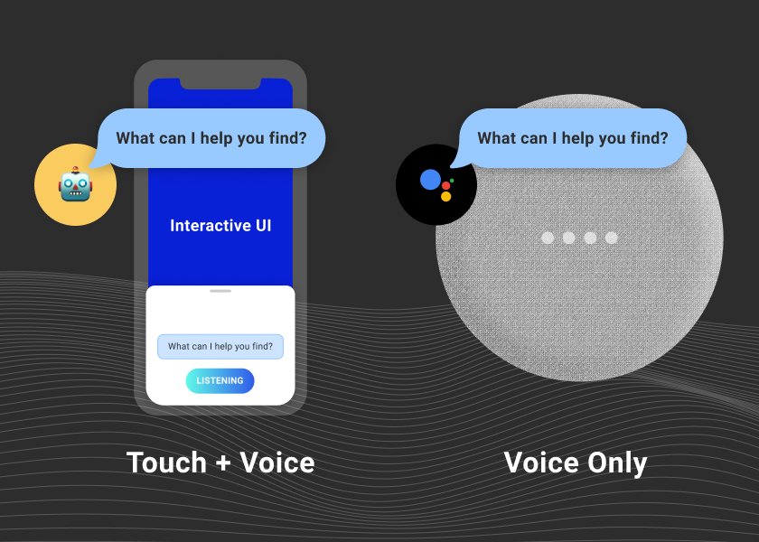

In the interest of fostering discussion about the state of voice tech, we're thinking of starting a new regular feature. It's tentatively titled "Ask the Cranky Computational Linguist" — which, of course, would be me. The title's not necessarily official, but I do get cranky from time to time, so it fits.

Our first topic is the question you clicked on to get here, but the answer is part of [our Substack publication](https://spokestack.substack.com/p/killer-voice-app). Posting there lets us send new issues directly to your inbox and interact in the comments section, but we don't want to leave our web site readers behind, so we'll add new issues as summary blog posts just like this one.

If you're interested in discussions like this, let us know by liking/subscribing on Substack, and feel free to submit new topics there or [via email](mailto:hello@spokestack.io?subject=Dear Cranky Computational Linguist). Thanks for reading!
