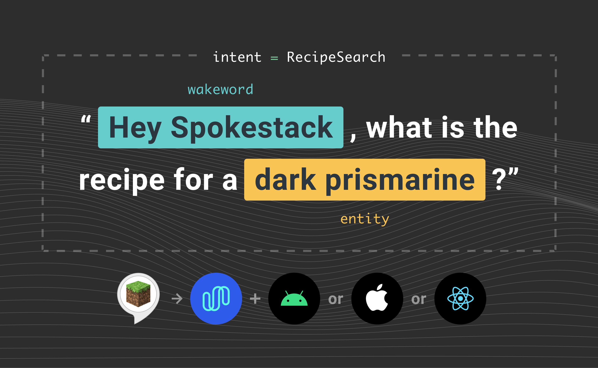

## Voice Apps on Smart Speakers

Over the last several years, intelligent virtual assistants such as Siri, Alexa, and Google Assistant have become increasingly more important in our everyday lives. Smart speakers like Amazon Echo and Google Home brought convenient, hands-free access to assistants into our homes. One way independent developers have improved these assistants is by creating add-ons collectively known as voice apps. Users access these voice apps through virtual assistant platforms on smart speakers.

Spokestack introduces a new way to build and access voice apps independent from major virtual assistant platforms. These articles cover what you need to move a smart speaker voice app onto a mobile device.

- Part 1: Voice Apps on Smart Speakers
- Part 2: [Voice Apps on Mobile](/blog/porting-a-smart-speaker-voice-app-to-mobile-part-2)
- Part 3: [Import an Alexa or Dialogflow Interaction Model](/blog/porting-a-smart-speaker-voice-app-to-mobile-part-3)
- Tutorial: [Create an Alexa-Compatible Dialog Manager in Swift](/blog/create-an-alexa-compatible-dialog-manager-in-swift)
- Tutorial: [Porting the Alexa Minecraft Skill to iOS Using Spokestack](/blog/porting-the-alexa-minecraft-skill-to-ios-using-spokestack)
- Tutorial: [Porting the Alexa Minecraft Skill to Android Using Spokestack](/blog/porting-the-alexa-minecraft-skill-to-android-using-spokestack)
- Tutorial: Porting the Alexa Minecraft Skill to React Native Using Spokestack (Coming Soon)

### What's Wrong With Smart Speaker Voice Apps?

Voice apps like Alexa Skills and Google Actions have been an exciting new frontier for developers over the last few years. Voice apps let virtual assistants delegate some interactions to third-party applications running on the platform. Voice apps are to smart speakers what mobile apps are to smartphones.

Unfortunately, consumer adoption of voice apps has not been as successful as adoption of mobile apps. Discovery and retention has been a [long-standing challenge](https://voicebot.ai/smart-speaker-consumer-adoption-report-2019/). Monetization remains elusive for most skill developers. As a result, 2019 saw the [lowest number](https://www.adweek.com/digital/new-voice-apps-are-declining-as-a-breakout-hit-remains-elusive/) of new Alexa skills released since 2016.

This doesn’t mean consumers are moving away from voice as an interface. Voice assistant usage is on track to [triple](https://techcrunch.com/2019/02/12/report-voice-assistants-in-use-to-triple-to-8-billion-by-2023/) in the next few years. Consumers have embraced voice as an interface. However, the model for third-party skills and actions has not been a success. Fortunately, there’s a way to free these voice apps and promote them as independent voice assistants embedded in smartphone apps.

### Transform Your Skill to a Mobile Voice Assistant

Moving voice apps off of smart speakers and into an app on a smartphone resets the conversation. You gain full control of your app’s branding and visual UI. This gives you the flexibility to integrate images, videos, and traditional GUI components as you see fit. You’re free from the commerce limitations Amazon and Google place on smart speaker voice apps.

Smart speakers and virtual assistants provide key components that are used to build voice apps. In order to move a voice app to a smartphone, you have to make sure you still have all the ingredients. Let's take a look at the ingredients needed to make a general voice app, regardless of platform.

`youtube: [Spokestack Overview](https://www.youtube.com/watch?v=MW2cYSQhbZE)`

### Universal Voice App Ingredients

1. A device with a microphone and speaker
2. A way to recognize human speech using the device’s microphone and a way to convert that speech to text
3. A dialog management system that takes the speech transcript and formulates a text response
4. A way to infer computer-readable meaning from the speech transcript
5. A way to convert the text back to speech and play it through the device’s speaker

If you are coming from a background in voice apps, chat bots, or virtual assistants, these ingredients will be very familiar to you. For those who aren't, some of these topics are worth a quick review.

#### Speech Recognition & Text-to-Speech

Converting speech to text is often called automated speech recognition (ASR). Converting text back to speech is known as text-to-speech (TTS). Both of these are memory-intensive operations usually performed using a cloud service. Smart speakers have built-in access to cloud services to perform both ASR and TTS.

#### Dialog Management System

A dialog management system takes the text transcript as input and formulates a response. This is known as a dialog turn. Developers are responsible for providing content for the responses in a process called fulfillment. Some dialog management systems will automatically perform tasks such as slot filling or re-prompting for misunderstood utterances.

#### Natural Language Understanding

In order to write logic for turns, developers need a way to infer meaning from text. This is known as natural language understanding (NLU). The state-of-the-art way of performing NLU is using deep learning models to infer "intent" from "utterances." Both Amazon and Google have cloud-based services where a developer can train an NLU model by giving example utterances for various intents. The developer decides which types of intents a voice app should respond to. Then he or she provides example phrases for each. Google and Amazon make their resulting NLU services available for voice apps to use.

### Voice Apps on Smart Speakers

If you’ve authored an Alexa Skill or Google Action, you’ve already mixed the ingredients needed to produce a voice app. The smart speaker hardware provides the microphone and speaker. Each smart speaker is integrated behind the scenes with a cloud service to perform ASR, NLU, and TTS. Amazon and Google provide SDKs to create a fulfillment web service that includes dialog management.

In this introduction we covered what smart speaker voice apps are and some of their limitation. We also covered what components are needed to build one and how the smart speaker hardware provides them. In [Part 2](/blog/porting-a-smart-speaker-voice-app-to-mobile-part-2) of this series we explore how to find these ingredients on a different device, a mobile phone.
