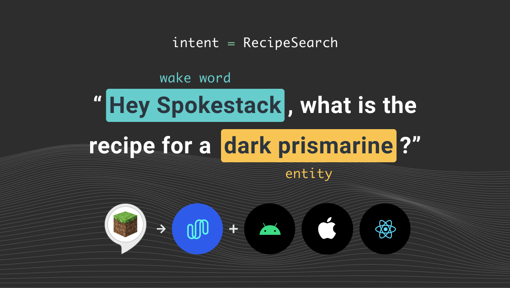

## Voice Apps on Mobile

In [Part 1](/blog/porting-a-smart-speaker-voice-app-to-mobile-part-1) of this series we covered covered what smart speaker voice apps are and some of their limitation. Part 2 describes what we need to do to port a smart speaker voice app to a smartphone.

If you’ve authored an Alexa Skill or Google Action, you’ve already mixed the ingredients needed to produce a voice app. The smart speaker hardware and virtual assistant software provide the ASR, NLU, and TTS. You create the fulfillment and dialog management with the help of the platform SDKs.

To move your smart speaker skill or action to a mobile device, you need to mix the same 5 ingredients we introduced in Part 1.

### Without Spokestack

1. Modern smartphones have integrated microphones and speakers you can access. Both Android and iOS devices allow app to access audio input and output using their development kits.
2. Android provides programmatic access to Google’s ASR. iOS apps have access to Apple’s ASR.
3. You can write a dialog manager to handle conversation turns in your app.
4. You can train an NLU model using a cloud service like Amazon Lex or Google’s Dialogflow.
5. You can integrate a service like Amazon Polly or Google Cloud’s Speech-to-Text.

If you’re highly competent with native Android and iOS SDKs as well as with integrating third-party web services, you could write code to mix four of the five ingredients necessary for a mobile voice app. But, it’s not easy. We’ve done it. This experience is what drove us to create Spokestack. Our libraries for iOS, Android, and React Native consolidate mobile ASR, NLU, and TTS into a single, easy-to-use API.

### With Spokestack

1. ✅ Spokestack managed hardware control
2. ✅ Spokestack managed ASR
3. Custom Dialog Mananger
4. ✅ Import Alexa or Dialogflow conversation model for Spokestack NLU
5. ✅ Spokestack TTS

The Spokestack libaries simply make it easier for you to focus on the custom portions of your voice assistant experience like the conversation flow and the content. You have to worry much less about platform-specific implementation details.

[Part 3](/blog/porting-a-smart-speaker-voice-app-to-mobile-part-3) of this series will cover how to import an interaction model from Alexa or Dialogflow to create an on-device Spokestack NLU model. Following that we have a tutorial on how to [write a dialog manager](/blog/create-an-alexa-compatible-dialog-manager-in-swift) that mimics how your Alexa Skill or Google Action works on a smart speaker. Finally, we’ll go through some complete tutorials on how to add Spokestack to a mobile app on various platforms to recreate an Alexa Skill as an embedded assistant.
