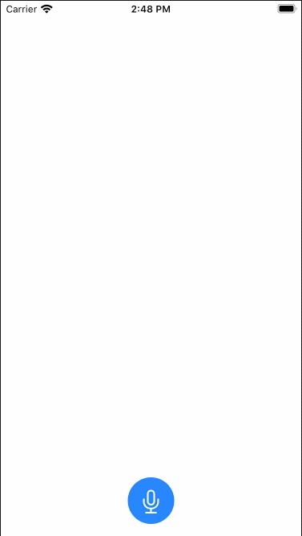

_This tutorial is part of the [Porting a Smart Speaker Voice App to Mobile](/blog/porting-a-smart-speaker-voice-app-to-mobile-part-1) series._

Spokestack makes it easy to convert a smart speaker voice app like a Google Action or Alexa Skill to a mobile app. In this tutorial, we’ll go through the entire process of converting a sample Alexa skill into an iOS app using SwiftUI.

We’ve provided some components and boilerplate code so you can follow along more easily. You can download the starting and final versions of the [code here](https://d3dmqd7cy685il.cloudfront.net/docs/minecraft-ios-tutorial.zip).

This tutorial is a direct port of the [Alexa sample skill](https://github.com/alexa/skill-sample-nodejs-howto) from Alexa’s GitHub repository. We stayed as true as possible to the original and didn’t try to improve on it too much at this point.

## Installation and Setup

The easiest way to install Spokestack on iOS is using CocoaPods as described in more detail in the [getting started docs](/docs/iOS/getting-started). Download and unzip the [example code](https://d3dmqd7cy685il.cloudfront.net/docs/minecraft-ios-tutorial.zip). In the "start" folder, you’ll see a `Podfile` with the following contents:

```ruby
platform :ios, '13.0'

target 'Minecraft Skill Demo' do
    use_frameworks!
    pod 'Spokestack-iOS'
    pod 'Fuse'
end
```

Run the command `pod install` to download and install the dependencies. Next, open `Minecraft Skill.xcworkspace` using XCode.

## Make the App Listen

If you run the app now, you’ll see it doesn’t do much. It just displays a screen with a microphone button.


Next, you’re going to start the Spokestack speech pipeline so that your app can hear you. You’re going to configure the app so that it starts listening when you press a button.

The example code contains a class `PipelineStore` that implements [the delegates](/docs/iOS/speech-pipeline) in the Spokestack speech pipeline. The `init` method of our `ContentView` already calls the `pipelineStore.start()` method to start background processing. To begin actually listening, add a new function to `PipelineStore`:

```swift
func activatePipeline() {
    print("[\(mode)] manually activating pipeline")
    self.pipeline.activate()
    DispatchQueue.main.async {
        self.isListening = true
    }
}
```

This new function does two things. First, it calls the `activate()` method on the pipeline to start actively listening for voice input. Second, it sets the variable `isListening` to `true`. Since `isListening` is `@Published`, changes to the variable will automatically be reflected in the UI.

Let’s also modify the `SpeechEventListener` implementation in `PipelineStore` so that you can update the UI with what the user said:

```swift
func didRecognize(_ result: SpeechContext) {

    print("[\(mode)] didRecognize \(result.isSpeech) and transscript \(result.transcript)")
    DispatchQueue.main.async {
        self.appSays = nil;
        self.userSays = result.transcript
    }
}
```

Using the `ContentView` class, you can modify your button so it will toggle between listening and not listening when pressed:

```swift
    Button(action:{
        if (self.pipelineStore.isListening) {
            self.pipelineStore.deactivatePipeline()
        } else {
            self.pipelineStore.activatePipeline()
        }

    }) {
    ListeningIcon(isListening: $pipelineStore.isListening)
        .background(Color.blue)
        .foregroundColor(Color.white)
        .cornerRadius(40)
    }.padding()
```

Try running the app now. At this point, you should be able to press the button, say something, and see what you said appear in the UI.


### Make the App Understand

For this tutorial, we built an Alexa skill that allows you to ask for instructions on how to build an item in Minecraft. To do this, we needed to understand what the user is asking about and respond accordingly.

This tutorial includes Alexa’s [interaction model](https://github.com/alexa/skill-sample-nodejs-howto/blob/master/models/en-US.json) JSON file. To make our app understand, you’ll need to import this interaction model into your Spokestack account and get an on-device NLU model back. The NLU model consists of two files. For convenience they are already included in the `Resources` folder of the tutorial iOS project:

- nlu.tflite - a TensorFlow Lite model file
- metadata.json - the model metadata

There is also a third file `vocab.txt` that is the BERT Wordpiece vocabulary. This is the same for every NLU model and can be [downloaded here](https://d3dmqd7cy685il.cloudfront.net/nlu/vocab.txt).

The sample code has a convenience class `NLUService` that loads these files and creates a `NLUTensorflow` instance. Now you can add an instance of the NLU service to `PipelineStore`:

```swift
    private var nluService = NLUService("nlu")
```

Let’s use this service to update our `didRecognize()` function again. The following code will pass the results from speech recognition to your NLU model for classification. For now, you should see results in your console.

```swift
func didRecognize(_ result: SpeechContext) {

    print("[\(mode)] didRecognize \(result.isSpeech) and transscript \(result.transcript)")
    DispatchQueue.main.async {
        self.appSays = nil;
        self.userSays = result.transcript
    }

    let _ = nluService.nlu!.classify(utterances: [result.transcript])
    .subscribe(on: DispatchQueue.global(qos: .userInitiated))
    .sink(receiveCompletion: { completion in
        switch completion {
        case .failure(let error):
            // respond appropriately to an error in classification
            print("nlu failure \(error)")
            break
        case .finished:
            // respond appropriately to finished classification
            print("nlu finished")
            break
        }
    }, receiveValue: { results in
        let _ = results.map({ result in
            print("nlu result")
            print(result)
        })
    })
}
```

### Make the App Respond

The process of taking classification results and converting them into a response is the job of a dialog manager. Previously, we discussed how to [create a dialog manager in Swift](/blog/create-an-alexa-compatible-dialog-manager-in-swift) that mimics the Alexa SDK for Node.js syntax. The example code includes a partially complete dialog manager `SkillDialogManager`.

If you compare the code for the `SkillDialogManager` to the [Alexa Node.js handler](https://github.com/alexa/skill-sample-nodejs-howto/blob/master/lambda/custom/index.js), you will see it is shockingly similar. Our dialog manager is just missing the `RecipeHandler`. Let’s add that to `SkillDialogManager` now.

```swift
struct RecipeHandler: RequestHandler {
    func canHandle(handlerInput: HandlerInput) -> Bool {
        return (handlerInput.requestEnvelope.request.type == "IntentRequest" && handlerInput.requestEnvelope.request.intent!.name == "RecipeIntent")
    }

    func handle(handlerInput: HandlerInput) -> Response {
        //return HandlerOutput(speak: "")

        let item:Slot? = handlerInput.requestEnvelope.request.intent!.slots?["Item"]

        print("got item \(item)")
        let repromptSpeech = responses["RECIPE_NOT_FOUND_REPROMPT"]!

        if (item != nil) {
            let itemValue:String = item!.value! as! String
            print("got value \(itemValue)")

            let fuse = Fuse(threshold:0.3)
            let keys = Array(recipes.keys)

            //let's do a fuzzy match to deal with an imperfect ASR
            let results = fuse.search(itemValue, in: keys)

            results.forEach { item in
                print("score: \(item.score) - \(keys[item.index])")
            }

            var recipe:String? = nil;
            if (results.count > 0) {
                recipe = recipes[keys[results[0].index]]
            }

            guard let recipeContent = recipe else {
                let speak = String(format: responses["RECIPE_NOT_FOUND_WITH_ITEM_NAME"]!,itemValue)
                return handlerInput.responseBuilder.speak(speak + repromptSpeech).reprompt(repromptSpeech).getResponse()
            }

            return handlerInput.responseBuilder.speak(recipeContent).getResponse()
        } else {
            return handlerInput.responseBuilder.speak(responses["RECIPE_NOT_FOUND_WITHOUT_ITEM_NAME"]! + repromptSpeech).reprompt(repromptSpeech).getResponse()
        }
    }
}
```

`RecipeHandler` is set up to handle `RecipeIntent`. The code looks to see if there is an "item" slot type that holds the name of the item we want to return a recipe for. The Alexa skill fulfillment logic is very straightforward. It just looks up the item name from a [JSON dictionary](https://github.com/alexa/skill-sample-nodejs-howto/blob/master/lambda/custom/recipes.js) and returns the recipe that matches. We can do the same in Swift. In fact, we copied the JSON file straight into XCode as `recipe.json`.

However, we improved this experience. ASR is not perfect and in some cases it really can’t be. For example, if I ask for a "recipe for red dye," ASR might register that as "recipe for red die." While "red dye" is in the dictionary, "red die" is not. There are a few strategies for resolving this that are beyond the scope of this tutorial, but a simple one is to implement a fuzzy match. Our `RecipeHandler` uses the [Swift Fuse library](https://github.com/krisk/fuse-swift) to find the best similar match instead of an exact match.

The next step is to register the new `RecipeHandler` with the dialog manager:

```swift
class SkillDialogManager {
    var session:[String:Any] = [:]
    var handlers:[RequestHandler] = [LaunchRequestHandler(),RecipeHandler(),HelpHandler(),RepeatHandler(),ExitHandler(),ErrorHandler()]

...
}
```

Lastly, update `didRecognize()` again to run NLU results through your dialog manager:

```swift
let _ = results.map({ result in
    print("nlu result")
    print(result)
    self.currentResponse = try! self.dialogManager.turn(type: "IntentRequest", nluResult: result)
    print(self.currentResponse.speak)
    DispatchQueue.main.async {
        self.appSays = self.currentResponse.speak
    }
})
```

At this point your app should be able to understand and answer questions.



### Make the App Speak

Up to this point, your app has recognized user speech, interpreted intent using an on-device NLU, and handled dialog just like the Alexa skill. Now, you want to make your app respond.

To add TTS capabilities, add this to your `PipelineStore`:

```swift
lazy private var tts: TextToSpeech = {
    return TextToSpeech(self, configuration: SpeechConfiguration())
}()

func speak(_ request:Response) {
    DispatchQueue.main.async {
        self.appSays = request.speak
        self.isSpeaking = true
    }
    self.currentResponse = request
    self.tts.speak(TextToSpeechInput(request.speak))
}
```

Then, make a final modification to `didRecognize()`:

```swift
let _ = results.map({ result in
    print("nlu result")
    print(result)
    self.currentResponse = try! self.dialogManager.turn(type: "IntentRequest", nluResult: result)
    print(self.currentResponse.speak)
    DispatchQueue.main.async {
        self.appSays = self.currentResponse.speak
        self.isSpeaking = true
    }
    self.tts.speak(TextToSpeechInput(self.currentResponse.speak))

})
```

These changes make the app respond with recipe instructions and update the UI accordingly while the app is speaking.

To make the app behave more like a smart speaker skill, you can also handle a `LaunchRequest` when the app starts. The app will call the dialog manager to get intro text and read it to user when the app launches.

To achieve this, modify `ContentView` as follows:

```swift
var body: some View {
    VStack {
        ...
        if (!pipelineStore.isSpeaking ) {
            Button(action:{
                if (self.pipelineStore.isListening) {
                    self.pipelineStore.deactivatePipeline()
                } else {
                    self.pipelineStore.activatePipeline()
                }

            }) {
            ListeningIcon(isListening: $pipelineStore.isListening)
                .background(Color.blue)
                .foregroundColor(Color.white)
                .cornerRadius(40)
            }.padding()
        }
    }.onAppear{
            let speak = try! self.dialogManager.turn(type: "LaunchRequest")
            self.pipelineStore.speak(speak)
    }

}
```

The `onAppear` event handler fires when the view first appears. The `!pipelineStore.isSpeaking` logic hides the mic button while the app is speaking.

### Handling Reprompts

If the user doesn't say anything while the app is listening, we should reprompt. Again in `SpeechPipeline` modify the `didTimeout()` function.

```swift
func didTimeout() {
    print("[\(mode)] didTimeout")
    currentResponse = try! self.dialogManager.turn(type: "TimeoutRequest")
    print(currentResponse.speak)
    DispatchQueue.main.async {
        self.userSays = nil
        self.appSays = self.currentResponse.speak
        self.isSpeaking = true
    }
    self.tts.speak(TextToSpeechInput(currentResponse.speak))
}
```

This implementation is not very clever and will continue reprompting forever or until the user taps the mic button to deactivate the pipeline. A smarter implementation might only reprompt three times before giving up.

### Wrapping Up

This tutorial gives you a blueprint for converting any Alexa skill to a mobile app. Of course, mobile apps also have a screen. This only scratches the surface of what you could do to customize a skill. You can also display images, videos, or complex visual user interfaces as part of a response to a voice request.

If you get stuck at any point during this tutorial, please reach out to us on the Spokestack community [forum](https://forum.spokestack.io). And if you build something cool, please let us know!
