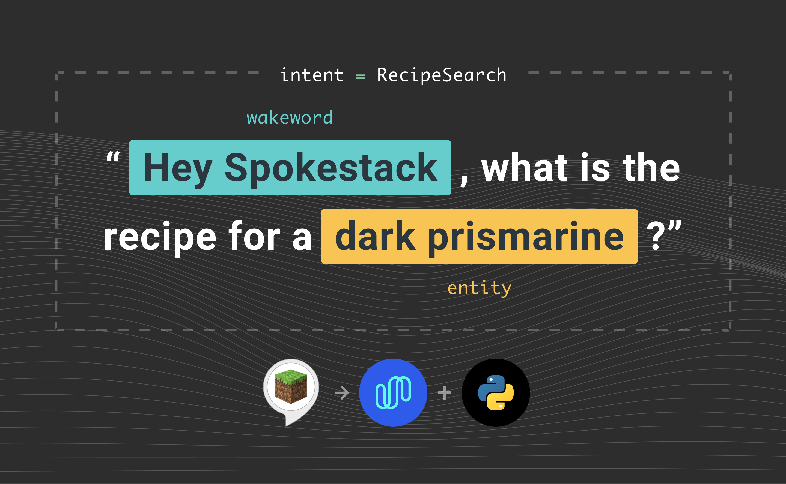

This is a tutorial on how to port a simple [Minecraft recipe skill](https://github.com/alexa/skill-sample-python-howto) to Spokestack using the [spokestack-python](https://github.com/spokestack/spokestack-python) library. It is similar to [our mobile tutorial series](/blog/porting-a-smart-speaker-voice-app-to-mobile-part-1), but the Python version not have any GUI components. This makes the experience closer to that of a smart speaker. We will discuss the concepts for each part of the user interaction briefly, but for a full description check out our [documentation](/docs/Concepts). Before we get into the programming, we will need to get API keys from our Spokestack account.

## Signing Up for a Spokestack Account

1. [Create](/create) a Spokestack account.
1. In the [settings dashboard](/account/settings/), click "API Credentials" and add a token.
1. Copy the secret key when it is displayed; you'll need it later.

## Setting up the Project

First let's make a directory to hold the project.

```bash
git clone https://github.com/spokestack/minecraft-skill-python
cd minecraft-skill-python
```

Then there are some system dependencies.

### macOS

```bash
brew install lame portaudio
```

### Debian/Ubuntu

```bash
sudo apt-get install portaudio19-dev libmp3lame-dev
```

Now let's set up the python virtual environment. We use [`pyenv`](https://github.com/pyenv/pyenv) and [`pyenv-virtualenv`](https://github.com/pyenv/pyenv-virtualenv) to manage virtual environments, but any virtual environment will work.

```bash
pyenv install 3.7.6
pyenv virtualenv 3.7.6 minecraft
pyenv local minecraft
```

Then the python dependencies.

```bash
pip install -r requirements.txt
```

### TFLite Runtime

In addition to the Python dependencies, you will need to install the TFLite Interpreter. You can install it for your platform by following the instructions at [TFLite Interpreter](https://www.tensorflow.org/lite/guide/python#install_just_the_tensorflow_lite_interpreter). Note: this is not the full [Tensorflow](https://www.tensorflow.org/) package.

If you would like to try out the final version of the Minecraft app, you can now run it with:

```bash
python app.py
```

To follow along with the tutorial, we recommend making a new python file titled `myapp.py` or similar so you can compare it to the original `app.py`.

## Using the Speech Pipeline

An essential piece to any voice interface is the ability to detect when the user is speaking, then convert the spoken phrase into a text transcript. Spokestack has an [easy-to-use speech pipeline](/docs/Concepts/pipeline-configuration) that will handle this for us. The speech pipeline consists of three major components: a voice detection module, a wakeword trigger, and a speech recognizer.

### Microphone Input

Accepting audio input is always the first step in the pipeline. For this demo, we will use the included [input class](https://github.com/spokestack/spokestack-python/blob/4009a9d8b61cd4375886c66ca0d4a87d99e12153/spokestack/io/pyaudio.py#L8) that leverages [PyAudio](http://people.csail.mit.edu/hubert/pyaudio/) to stream microphone input to the pipeline. The class is initialized like this:

```python
from spokestack.io.pyaudio import PyaudioMicrophoneInput

mic = PyaudioMicrophoneInput()
```

### Voice Activity Detection

The second component we are adding to the pipeline is the [VoiceActivityDetector](https://github.com/spokestack/spokestack-python/blob/4009a9d8b61cd4375886c66ca0d4a87d99e12153/spokestack/vad/webrtc.py#L18). This module analyzes a single frame of audio to determine if speech is present. This will be the component that allows audio to flow through the rest of the pipeline. For simplicity, we will use the the default voice activity detection settings. The voice activity component can be initialized with the following:

```python
from spokestack.vad.webrtc import VoiceActivityDetector

vad = VoiceActivityDetector()
```

Now that we have a way to determine if the audio contains speech, let's move on to the component that activates the pipeline when it hears a specific phrase.

### Wakeword Activation

The [wakeword](/docs/Concepts/wakeword-models) component of the pipeline looks for a specific phrase in the audio input and signals the pipeline to activate ASR when it is recognized. For our purposes, we will be using "Spokestack" as the wakeword. As with most voice assistants, "Hey Spokestack" will work as well. The process to initialize this component mirrors the way we set up voice activity detection. The directory passed to `model_dir` should contain three `.tflite` files: `encode.tflite`, `detect.tflite`, and `filter.tflite`. These can be found inside the `tflite` directory of the project GitHub repository.

```python
from spokestack.wakeword.tflite import WakewordTrigger

wakeword = WakewordTrigger(model_dir="tflite")
```

Once the skill is actively listening for user speech, all we have to do is transcribe what the user says.

### Automatic Speech Recognition (ASR)

[ASR](/docs/Concepts/asr) is the most critical piece of the speech pipeline, because it produces the transcript that is used to turn speech into actions. However, critical components do not have to be difficult to add. The following initializes the [ASR component](https://github.com/spokestack/spokestack-python/blob/4009a9d8b61cd4375886c66ca0d4a87d99e12153/spokestack/asr/speech_recognizer.py#L12).

**Note:** This is where you will need your API keys from the account console.

```python
from spokestack.asr.speech_recognizer import CloudSpeechRecognizer

recognizer = CloudSpeechRecognizer(
    spokestack_id="your_spokestack_key",
    spokestack_secret="your_secret_key",
)
```

### Activation Timeout (Optional)

An issue you may run into is the ASR not being activated long enough or being active for too long. To configure this for your use case, you can add the `ActivationTimeout` component to the pipeline with a minimum and maximum value in milliseconds. This component can be initialized with the following:

```python
from spokestack.activation_timeout import ActivationTimeout

timeout = ActivationTimeout(min_active=100, max_active=5000)
```

### Speech Pipeline

Now, we can put it all together in the [pipeline](https://github.com/spokestack/spokestack-python/blob/4009a9d8b61cd4375886c66ca0d4a87d99e12153/spokestack/pipeline.py#L9). After this step, you will be able to wake the assistant by saying "Spokestack" and produce a text transcript of what is said next. For the Minecraft skill you would say something like, "Spokestack, what is the recipe for a snow golem?".

```python
from spokestack.pipeline import SpeechPipeline

# without timeout
pipeline = SpeechPipeline(input_source=mic, stages=[vad, wakeword, recognizer])

# with timeout
pipeline = SpeechPipeline(
    input_source=mic, stages=[vad, wakeword, recognizer, timeout]
)
```

## Events

We know that the goal of the pipeline is to produce a transcript of the user's speech. However, we haven't discussed how to access that transcript. The pipeline is designed to run continuously, but we can use event handlers to access the transcript without stopping the pipeline. For this tutorial, we want to pass the completed transcript to a module that helps us _understand_ what the user has said. To accomplish this, we register an event handler with the pipeline:

```python
@pipeline.event
def on_speech(context):
    transcript = context.transcript
    print(transcript)
```

In the application, we don't want to print the transcript, but we've added that so you can see the results if you've been running the code as you follow along. In the subsequent sections, we will discuss a couple new components and also flesh out this event handler to allow the Minecraft skill to understand the user's request and select an appropriate response.

## Natural Language Understanding (NLU)

The Natural Language Understanding, or [NLU](/docs/Concepts/nlu), component takes a transcript of user speech and distills it into unambiguous instructions for an app. The paradigm used in most systems is the intent and slot model. Essentially, an intent is the function the user intends to invoke, and the slots are the arguments the intent needs to accomplish its action. For example, a user may say `What is the recipe for a dark prismarine?`. In this case, the intent is `RecipeSearch`, and the slot is `dark prismarine` . The initialization of the [TFLiteNLU](https://github.com/spokestack/spokestack-python/blob/4009a9d8b61cd4375886c66ca0d4a87d99e12153/spokestack/nlu/tflite.py#L18) should look familiar at this point. The directory passed to `model_dir` contains three files: `vocab.txt`, `metadata.json`, `nlu.tflite`. These files are necessary to run our on-device NLU model and are in the `tflite` directory of the GitHub repository.

```python
from spokestack.nlu.tflite import TFLiteNLU

nlu = TFLiteNLUModel(model_dir="tflite")
```

Now is a good time to add the NLU to our `on_speech` event handler:

```python
@pipeline.event
def on_speech(context):
    transcript = context.transcript
    results = nlu(transcript)
```

Now that we know what recipe the user is looking for, you may be wondering how we turn this into a response. The following section will explain just that.

## Dialogue Management

The Minecraft dialogue manager is fairly simple. The basic component necessary is a way to look up the recipes, and the rest is just string interpolation. Since we have a relatively limited number of recipes, we can implement the lookup as a simple dictionary in Python. Below is a snippet of the recipe "database".

```python
DB: Dict[str, str] = {
    "snow golem": "A snow golem can be created by placing a pumpkin on top of  two "
    "snow blocks on the ground.",
    "pillar quartz block": "A pillar of quartz can be obtained by placing a block of "
    "quartz on top of a block of quartz in mine craft.",
}
```

This makes looking up a recipe very concise: `DB.get("snow golem")`. There can be an issue with using the dictionary lookup alone though. Let's say that due to an ASR error the parsed slot isn't a full match for `snow golem`, but it is something like `sow golem`. A simple dictionary lookup will not be able to resolve those slots. However, there is a method that we can add to deal with small errors like that. This method is called [fuzzy matching](<https://en.wikipedia.org/wiki/Fuzzy_matching_(computer-assisted_translation)>), and based on the similarity between `snow golem` and `sow golem` we can make sure that the latter resolves to the actual entity. In this tutorial, we will use the python library `fuzzywuzzy` to make these matches. Below is the way it is used in the tutorial repository.

```python
from fuzzywuzzy import process

matched, score = process.extractOne(slot["raw_value"], self._names)

if score > self._threshold:
    recipe = self._recipes.get(matched)
```

We are simply overwriting the parsed entity with the one that is the closest match from the set of possible entities. The full dialogue manager can be seen below:

```python
from fuzzywuzzy import process  # type: ignore

from minecraft import recipes
from minecraft.responses import Response

class DialogueManager:
    """Simple dialogue manager

    Args:
        threshold (float): fuzzy match threshold
    """

    def __init__(self, threshold=0.5):
        self._recipes = recipes.DB
        self._names = list(self._recipes.keys())
        self._threshold = threshold
        self._response = Response

    def __call__(self, results):
        """ Maps nlu result to a dialogue response.

        Args:
            results (Result): classification results from nlu

        Returns: a string response to be synthesized by tts

        """

        intent = results.intent
        if intent == "RecipeIntent":
            return self._recipe(results)
        elif intent == "AMAZON.HelpIntent":
            return self._help()
        elif intent == "AMAZON.StopIntent":
            return self._stop()
        else:
            return self._error()

    def _recipe(self, results):
        slots = results.slots
        if slots:
            for key in slots:
                slot = slots[key]
                if slot["name"] == "Item":
                    return self._fuzzy_lookup(slot["raw_value"])
                return self._not_found(slot["raw_value"])
        else:
            return self._response.RECIPE_NOT_FOUND_WITHOUT_ITEM_NAME.value

    def _help(self):
        return self._response.HELP_MESSAGE.value

    def _stop(self):
        return self._response.STOP.value

    def _error(self):
        return self._response.ERROR.value

    def _fuzzy_lookup(self, raw_value):
        matched, score = process.extractOne(raw_value, self._names)

        if score > self._threshold:
            recipe = self._recipes.get(matched)
            return recipe
        return raw_value

    def _not_found(self, raw_value):
        return self._response.RECIPE_NOT_FOUND_WITH_ITEM_NAME.format(raw_value)
```

Now we can add the dialogue manager to the event handler.

```python
@pipeline.event
def on_speech(context):
    transcript = context.transcript
    results = nlu(transcript)
    response = dialogue_manager(results)
```

OK, that was a lot to cover, but we are almost to the finish line. In the next section, we will learn how to convert the app's text responses into speech.

## Text to Speech (TTS)

Much like the name suggests, [TTS](/docs/Concepts/tts) translates written text into its spoken form with a synthetic voice. This tutorial assumes you are using our default voice, but if you have a paid plan you can replace `demo-male` with the name of a custom voice. To initialize the [TTSClient](https://github.com/spokestack/spokestack-python/blob/4009a9d8b61cd4375886c66ca0d4a87d99e12153/spokestack/tts/clients/spokestack.py#L20), you simply do the following:

**Note:** This is another part where you will need your Spokestack API keys. However, notice that the URL for TTS is slightly different than for ASR.

```python
from spokestack.tts.clients.spokestack import TextToSpeechClient

client = TextToSpeechClient("your_key", "your_secret_key")
```

Another important aspect of this section is playback. We have a [PyAudio-based output class](https://github.com/spokestack/spokestack-python/blob/4009a9d8b61cd4375886c66ca0d4a87d99e12153/spokestack/io/pyaudio.py#L76) that will play through your system's default playback device. As a convenient way to manage speech synthesis and playback, we have the [TTSManager](https://github.com/spokestack/spokestack-python/blob/4009a9d8b61cd4375886c66ca0d4a87d99e12153/spokestack/tts/manager.py#L9). Look below to see how to initialize that with an output source.

```python
from spokestack.io.pyaudio import PyAudioOutput
from spokestack.tts.manager import TextToSpeechManager

output = PyAudioOutput()

manager = TextToSpeechManager(client, output)
```

Now we can update our event handler to read the response.

```python
@pipeline.event
def on_speech(context):
    transcript = context.transcript
    results = nlu(transcript)
    response = dialogue_manager(results)
    manager.synthesize(response, "text", "demo-male")
```

## Let's Run it!

We now have a fully working example except for two final commands. We have to start and run the pipeline!

```python
pipeline.start()
pipeline.run()
```

Then you can start the skill by running this command in the terminal. The skill will remain running until you say "stop".

```bash
python myapp.py
```

Now you should be able ask your skill about how to craft things in Minecraft. If you get a chance, I recommend trying it out in-game; despite its simplicity, it is actually very useful.

At this point you may have already cloned the repository, but if you have not, check out the full example on [GitHub](https://github.com/spokestack/minecraft-skill-python).

## Contact Us

If you have any questions while getting this set up we have a [forum](https://forum.spokestack.io/), or you can open an issue on [GitHub](https://github.com/spokestack/spokestack-python/issues). In addition, I am more than happy to help if you want to reach out to me personally via [email](mailto:will@spokestack.io) or [Twitter](https://twitter.com/_Will_Rice).
