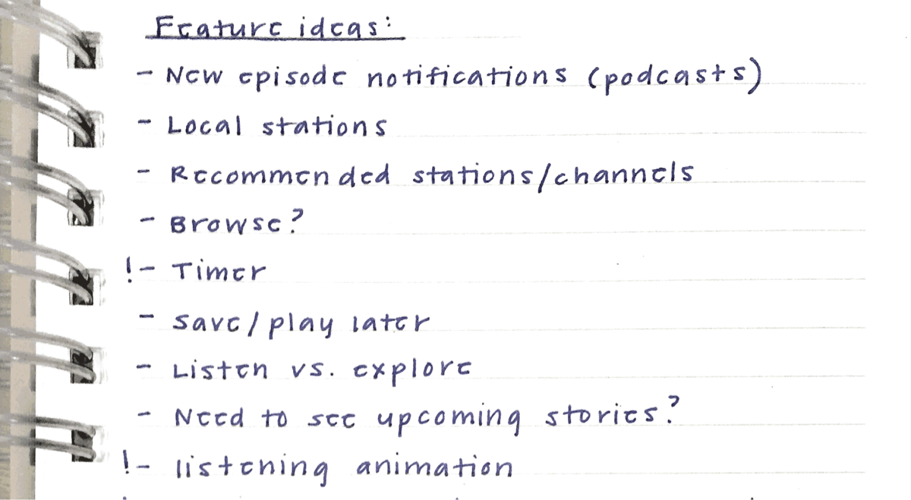

Setting aside time to test your voice assistant(s) with actual users is a worthwhile investment in usability. At Spokestack, I've conducted tests using prototypes and fully-realized voice user interfaces (VUI). How I test products is similar in execution to user interviews with a few exceptions. Your goal should be to gauge whether users are able to complete tasks using their voice. Refer to my [previous article](/blog/user-research-for-voice-experiences) on how to find candidates within your network. What will change is what you ask and look for. Here’s how I test voice assistants throughout the development process.

## Come prepared with research questions

Write a test script to guide usability testing that includes instructions, tasks, and questions. Here’s a [sample test script](https://docs.google.com/document/d/1291FI3KTP8ycVwqcaTJITAe5jQHfnt_t5XaLnMBbD6E/edit) I adopted from Steve Krug’s [_Rocket Surgery Made Easy_](https://www.amazon.com/Rocket-Surgery-Made-Easy-Yourself/dp/0321657292) that incorporates my suggestions. I start every test script with a list of research questions. Think of these as internal measurement tools for your observations. These will include any uncertainties you want to put to rest without directly asking users these questions. Here are some examples.

- Do users know what to ask or say?
- Are they running into any errors?
- (If applicable) Do they understand that your app is wake word enabled? Did they use this feature? If not, why?

## Keep context in mind when setting up your test environment

This is where survey demographics will come into play. Decide where you want candidates to test usability. For example, if your voice assistant will be used primarily outside where there’s lots of background noise, make sure you test outside. If you’re unable to replicate the environment, start each task by framing context. For example, if your target demographic uses voice commands frequently while driving, start a task with something like “Imagine you’re commuting to work.” Remind them of context as it changes. With the previous example, if they’re supposed to complete a task while they’re no longer commuting, include something like “You’ve reached your destination and are out of the car.”

## Write tasks focused on usability, not opinions

Refer back to your research questions for these. You’ll want to test features that are likely going to be most used as well as features you’re the most unsure about. Here are my tips for writing tasks that effectively test voice assistants:

- Remind subjects to share what they’re doing and thinking out loud as much as possible.
- Ask users for their first impression after they’ve completed their first task. Encourage constructive feedback when warranted and avoid asking if they “like” or “dislike” something.
- If you included the last research question from above in your script, don’t explicitly tell users your app is voice-enabled. You want to understand whether or not they can determine this on their own. Avoid including trigger or wake words in your tasks. If a user mistakenly activates their device, include phrasing for how to stop an interaction and continue.
- Don’t use technical terms.
- Include a few negative questions to reframe their thinking.

## Moderate some, but mostly listen & observe

If you see a user struggle to complete a task, try not to interrupt them unless they’re unable to continue. Ask follow-up questions directly after a related task has been completed. Otherwise, subjects are likely to forget any insights they had in the moment. Try to answer these by observing rather than explicitly asking them. Their actions will speak volumes. Here are some things to be on the lookout for:

- Do they know your app is voice-enabled?
- Do they understand what they can say? What they can access using gestures?
- Do they understand how to use voice commands moving forward?
- Are they asking the right questions? If not, what _are_ they asking?
- Are they ever at a loss for words?
- Do they default to touch instead of voice? If so, how often? It could be out of habit or personal preference. It could also be a sign that there were too many speech recognition or understanding errors.
- If they use the wake word more than once, what is their reaction after repeated usage? Did they find it useful or cumbersome to use?
- Do they understand when the app is listening to them?
- If your app supports voice output, how are they reacting to different responses? Are you providing too much information or just enough for them to move forward?
- What is their reaction to your synthetic voice and any sounds used? Are they too robotic? Too personable? If their reaction is negative, what would they prefer?

## Incorporate what you observed into your product road map

Your colleagues will have likely written brief notes during the test. After testing, I go back and watch recordings to document takeaways and discuss with fellow observers by doing the following:

- Write down insights from your observations without providing a solution. Include direct quotes that stood out to you after listening to your discussion a second time.
- Discuss and group overlapping ideas with your team.
- Write a brief problem statement that accurately captures each group. Discuss and document possible solutions. This could include things like bug fixes, tweaks to existing features, new features, etc.
- Look back at your solutions list and let your observations guide the level of priority for each. Incorporate these into your existing product road map.

Continue to iterate and test throughout your product’s evolution. For more help designing independent voice assistants, visit the [design](/docs/design/getting-started) section of our documentation.
