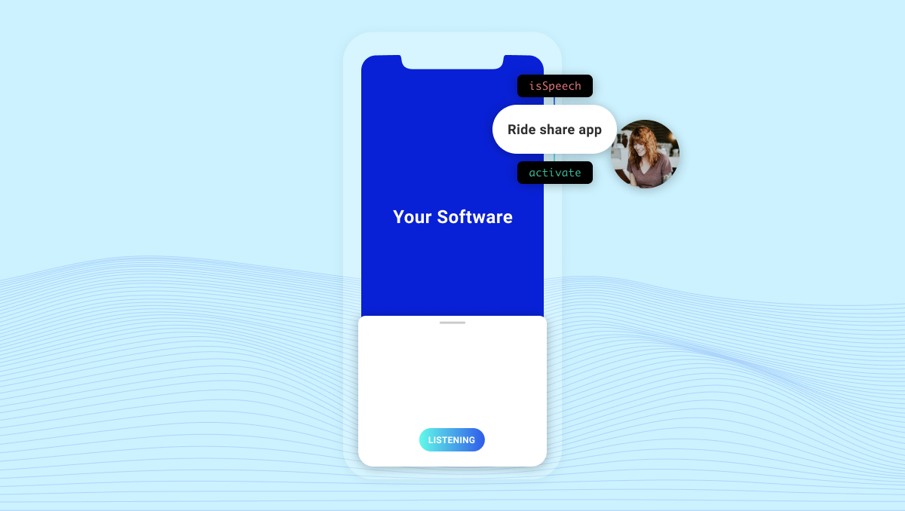

Amazon added the "Hey Alexa" wake word to its mobile app. This is going to change user perceptions of mobile voice apps.

One of the main hurdles I've encountered when explaining mobile voice apps to people is that they don't seem to understand how to start talking to mobile apps. For some reason, it's difficult for people to get their heads around the idea that a mobile app is the same as a smart speaker such as an [Alexa Skill](https://www.amazon.com/alexa-skills/) or a [Google Assistant Action](https://assistant.google.com/explore).

If you want our smart speaker skill [The Bartender](https://thebartender.io) to recommend a cocktail and help you make it, you have to say the following, depending on which smart speaker assistant you're talking to:

> "Hey Alexa, ask the Bartender for a drink."

or

> "Hey Google, open the Bartender."

After invoking the Bartender, the user can start a search for a drink by name or ingredient. Pretty simple, right?

So why is it such a leap to think the same interaction can't happen on mobile?

Because users haven't been shown enough examples of mobile apps carrying out tasks by voice yet.

We think that if Alexa trains users to understand that they can say

> "Hey Siri, open Alexa"

to have a conversation, it will change users' expectations of mobile voice conversations.

https://twitter.com/spokestack/status/1280660757823160321

That's because the Alexa mobile app will help users make the mental connection that, in addition to Siri and Google Assistant, mobile apps can carry on conversations with them on their mobile device. Specifically, they can have robust conversations that help them complete tasks they wouldn't otherwise be able to accomplish as fast. It might be because they are driving or in some sort of hands-free situation. Or might just be because voice is faster and easier than tapping and typing for certain tasks. Either way, convenience tends to drive consumer adoption once they see it.

For example, did you know you can open any app on your phone by asking for it? Think of your favorite app, then ask Siri or Google to open it for you. Seriously, try it now!

That's convenient and definitely faster than scrolling through pages of apps to get to the service or content you need. So the next step is adding voice to your app so you can talk with your customer, just like Alexa is going to do.

`youtube: [The Basic Elements of Voice Interfaces](https://www.youtube.com/watch?v=1x4MdTKEy3E)`

To be fair, Alexa isn't the first mobile app to add a voice interface or wake word. Spotify, Home Depot, Sephora, Pandora, and Snapchat have all added voice to their apps with varying degrees of interaction. Most focus on initiating a product search, which makes sense. It's just that the interactions, sans the ones built by Houndify, are not that robust.

We think all of that will change which is why we built Spokestack. So if you're looking for a wake word, on-device NLU, or custom synthetic voice to speak to your customer, email us at [hello@spokestack.io](mailto:hello@spokestack.io).
