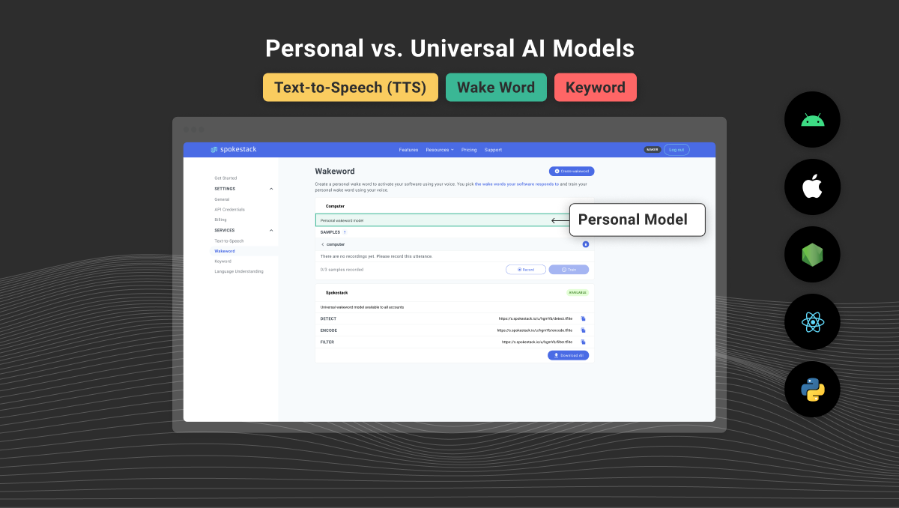

The [Spokestack Maker](/account/pricing#maker) service is designed for two audiences: (1) hobbyists who want to personalize their projects, and (2) developers who want to prototype a project as realistically as possible before committing to training a universal wake word model or studio-quality text-to-speech (TTS) voice. This is a great way to test drive the technology without breaking the bank.

## What are the Differences Between "Personal" and "Universal" Voice AI Models?

Like any neural models, the personal models created with these tools are only as good as the data they're trained on. In other words, a wake word created in Maker will not respond to everyone else in the world as well as it does to you if it's shipped in a mobile app — it will only work reliably for voices that resemble the one(s) it was trained with.

For a home automation project, though, this specificity might be a feature — have you ever wished that your smart speaker didn't listen to the kids quite so well? (Of course, if you _do_ want your DIY smart speaker to listen to everyone, you can call the kids over to the computer and have them help you train it!)

Similarly, with Maker personal TTS you can train a clone of your voice in just 75 sentences. However, its pronunciation and similarity to the human it's mimicking isn't going to be quite as good as a voice trained on dozens of hours of audio recorded in a studio. It'll still be plenty recognizable — check out the voices on our showcase along with their training criteria — but high-quality samples, and lots of them, always produces better models than low-resource data. If you happen to have good recording equipment and a quiet environment, we do have thousands of scripts queued up in the training tool, so go ahead and record as much as you have patience for. Our automatic model trainer will adjust to make the best use of the data you provide it.

With Spokestack Maker, you'll still be able to use the NLU model trainer and TTS showcase, but you'll also get access to three new tools for training your own [wake word](/docs/concepts/wake-word), [keyword](/docs/concepts/keywords), and [TTS](/docs/concepts/tts) models using data you record yourself.

You'll be able to download your custom models and make unlimited requests to your custom TTS voice as long as your Maker subscription is active. If you decide you'd like to take it to the next level and make a universal wake word/keyword model or a studio-quality TTS voice, [let us know](mailto:hello@spokestack.io?subject=I%20want%20to%20know%20more%20about%20Spokestack's%20Universal%20voice%20models)!
