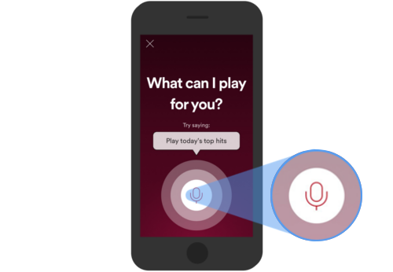
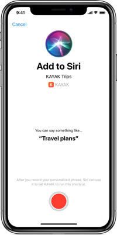

> &ldquo;A voice assistant is a digital assistant that uses voice recognition, speech synthesis, and natural language processing (NLP) to provide a service through a particular application.&rdquo;

If you search "[what is a voice assistant?](https://www.google.com/search?q=what+is+a+voice+assistant)" on Google, the definition above appears as the first result. This definition works because it lists the technologies required to provide human-to-computer voice interactions, a.k.a. a “voice interface”. Voice recognition, speech synthesis, and natural language processing technologies together create a [software stack](https://en.wikipedia.org/wiki/Solution_stack) that enables voice assistants to operate (a “Spokestack” you might say).

`youtube: [Voice is just another interface](https://www.youtube.com/watch?v=wbJ8fZh-iQw)`

So does providing a voice interface to a company’s digital services make it a voice assistant?

The answer is yes. Now let’s discuss the difference between a smart speaker (e.g. Alexa) smart speaker apps (e.g. [The Jeopardy Skill](https://www.amazon.com/gp/product/B019G0M2WS)), and independent voice assistants.

An independent voice assistant, sometimes referred to as an "owned assistant,” is a type of voice interface that enables companies to directly communicate with their customers. With independent assistants, there are no intermediaries (e.g. Alexa, Siri, Google Assistant) standing between companies and their customers. The conversation is heard, understood, and responded to directly by the company. This provides multiple benefits for both the consumer and the company.

## Mutual Benefits for Customers & Companies

Building an independent voice assistant offers more control over the customer experience, thereby creating the experience a company wants their customer to have with their brand. Benefits include:

1. Easier access to customer account and payment information.
2. A voice that best represents their brand over the platform’s voice (e.g. Siri's voice)
3. Data on intents and experiences that the company can use to inform product and service decisions.

## How Are Independent Voice Assistants Used?

Voice assistants can be integrated with existing mobile apps and/or websites. These can entail something as simple as offering voice search using a touch-to-talk mic button. They can also be more dynamic experiences that involve things like wake words to activate listening and content that is broken out into conversational pieces like step-by-step instructions.

Independent voice assistants can also co-exist with third party voice platforms (e.g. Siri, Google, Alexa). Currently, iOS and Android prefer using deep links ([Siri Shortcuts](https://support.apple.com/en-us/HT209055) for iOS; [App Actions](https://developers.google.com/assistant/app/overview) for Android) to interface with Siri and Google Assistant. Deep links require developers to link to parts of their application based on what the user says to Siri and Google Assistant. Developers who add voice to their app can have deep links resolve to a listening screen that asks the user “How may I help you?” and take over the conversation.

There is another scenario where companies can retain more control of the conversation on smart speakers by Alexa, but that’s a bit more complicated. We’ll save that for another post.

## Different Types of Voice Assistants

The difference between the types of voice assistants comes down to who controls the experience and how the voice assistant is accessed. The following is how we think about the different types of voice assistants based on control and access.

**Platform Assistants** handle natural language processing, speech synthesis, and a wake word that activates listening ("Hey Siri"), _and_ are tightly integrated with hardware such as smart speakers and mobile devices. These assistants are usually [general AIs](https://www.springboard.com/blog/narrow-vs-general-ai/) that try to answer every question a user may have. They also provide marketplaces for third party "voice apps" that make platform assistants smarter.

_Examples_: Siri, Alexa, Google Assistant, Bixby, [Mycroft](https://mycroft.ai/), [Snips](https://snips.ai/) (now Sonos).

**Voice Apps** exist within a platform assistant. They wrap content and services into an API that platform assistants can access and distribute. These apps offload natural language processing, speech synthesis and wake word control to platform assistants. They’re usually described in relation to the platforms where they operate, such as [Alexa Skills](https://www.amazon.com/alexa-skills/b?ie=UTF8&node=13727921011), [Google Actions](https://assistant.google.com/explore), [Bixby Capsules](https://www.samsung.com/us/explore/bixby/), etc.

_Examples_: Jeopardy! Skill, [Pizza Hut Action](https://assistant.google.com/services/a/uid/000000eab80a7f99), [iTranslate Capsule](https://www.itranslate.com/bixby)

**Independent Assistants** are voice assistants independent of platforms meaning that customer conversations are controlled by companies and developers without help from a platform assistant. This means companies are able to control natural language processing, speech synthesis, and wake word(s). These assistants can be integrated within existing products such as mobile apps, websites, and/or proprietary hardware.

`youtube: [Spokestack Overview](https://www.youtube.com/watch?v=MW2cYSQhbZE)`

_Examples:_ [Spotify](https://support.spotify.com/us/listen_everywhere/voice_assistants/spotify-voice/) (voice search), [Home Depot](https://corporate.homedepot.com/newsroom/5-technologies-changing-how-we-shop) (powered by Google’s Dialogflow for voice search), [Pandora](https://blog.soundhound.com/pandora-launches-voice-mode-in-mobile-app-powered-by-houndify-7d9091c66817) (powered by Soundhound).

[Spokestack](https://spokestack.io/) provides technology and services to enable developers to build independent voice assistants. Please email us at [hello@spokestack.io](mailto:hello@spokestack.io) if you are interested in hearing more about how we can help you build an independent voice assistant.
