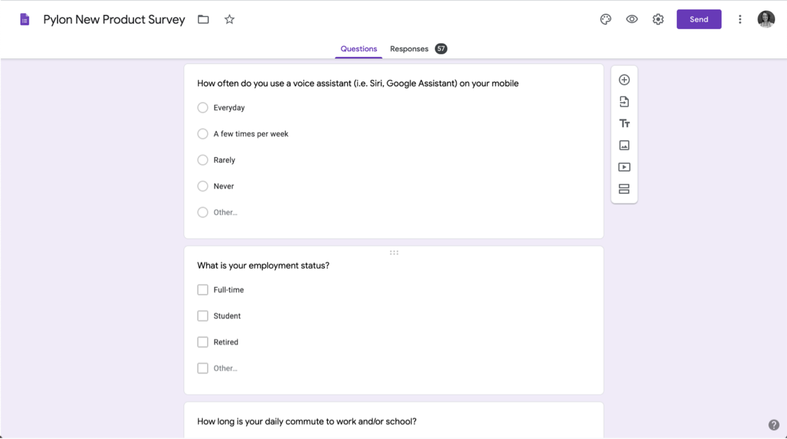

Recruiting folks to test your Voice User Interface (VUI) or [give insights on a concept](https://spokestack.io/blog/user-research-for-voice-experiences) is no easy task. Finding candidates in your target demographic takes time and prowess. You need to know where your users are in order to reach them in the first place. Relying on your network is a great way to quickly get feedback. However, even with old acquaintances, I’ve found myself (maybe not wanting to, but) needing a tool to capture basic demographic information. For this, I recommend using a survey.

## Really…you want me to use a survey?

The value of surveys has [come into question](https://medium.com/mule-design/on-surveys-5a73dda5e9a0) in the greater design community, and with good reason. I urge you to take your results with a grain of salt. For one thing, they can be inherently biased. Use them as a starting point rather than a means to an end. These results are not definitive nor are they statistically accurate.

Leverage them to help you gain _some_ perspective, but don’t let them dictate the whole picture. For example, in one study, I wanted to interview people who used voice assistants while driving. One user said in the survey he used Google Assistant on Android daily and spent a decent amount of time commuting in his car. However, during our interview, he admitted he wouldn’t use voice commands while he had a sleeping baby in the back seat which was most of his time spent in the car. The survey results provided a good starting point for our discussion that lead me to discover a new demographic I hadn’t considered.

## Ask the _right_ questions up front & save time later

Start by your letting subjects know what to expect. Be transparent about the length. Use a mix of [quantitative and qualitative research questions](https://www.nngroup.com/articles/qualitative-surveys/) Limit your questions to no more than ten to increase engagement. In general, stick with multiple choice or questions that can be answered with a short response.

Decide what information is most critical to your research. Understand how your audience already uses voice in their daily routines. For example, when testing a voice-enabled mobile audio service with users, I surveyed fifty or so candidates from my community. I wanted to test with a mix of voice assistant power users and people who didn’t use voice assistants at all. I found this was a good way to understand and, as a result, better design for both perspectives. I also asked a mix of questions about their listening habits - what they usually listen to, how, etc. Knowing these answers helped me better prepare my conversation, saving time for both me and my subjects.

<figure>

<figcaption>Here’s an example of some survey questions used when recruiting folks to usability test Radiobrain.</figcaption>
</figure>

Limit open-ended feedback. You’ll be able to further probe for detail when conducting user interviews. Draft your survey and get feedback from those you trust. Here’s a [sample survey](https://docs.google.com/forms/d/1faU7-M5zxTLjpTrweklUl1AELeaKsPMzcY7ipENxL60/edit) I created to get you started.

For more help designing independent voice assistants, visit the [design](https://spokestack.io/docs/Design/getting-started) section of our design documentation.
