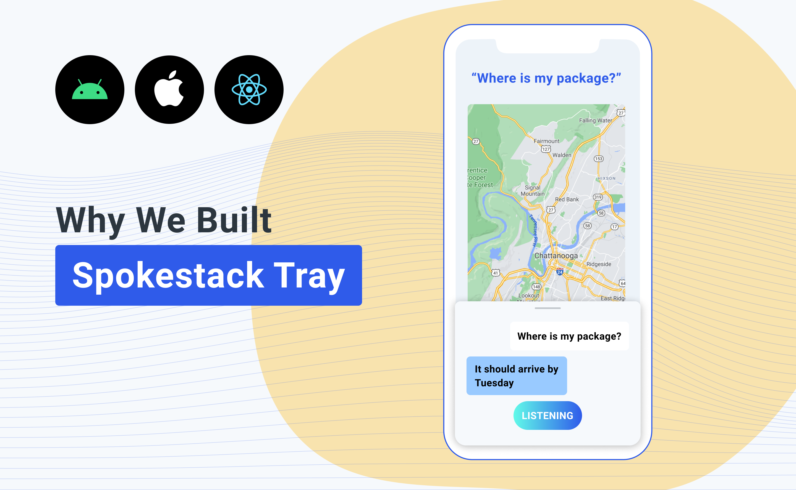

We started Spokestack to give developers the freedom to build the conversational experiences they wanted to build _without_ limitations. So we created [iOS](https://github.com/spokestack/spokestack-ios), [Android](https://github.com/spokestack/spokestack-android), and [React Native](https://github.com/spokestack/react-native-spokestack) libraries that give mobile developers complete flexibility for adding voice interfaces to their mobile apps. We made it possible for a mobile developer to design and deploy a voice interface any way they felt like it.

But sometimes a blank slate is daunting. Asking someone with no background in linguistics to build a conversational experience from scratch was like asking someone who hasn't skied before to pull off a ski jump.

<figure>

<figcaption>Not a real developer. Don't try this at home.</figcaption>
</figure>

As it turns out, few mobile developers understand how to [design conversational experiences](https://spokestack.io/docs/design/getting-started). And few voice developers know how to build mobile apps. At Spokestack, we're hoping to nudge both sides closer to each other.

With Spokestack Tray, we've created a ready-made "voice kit" that still allows for customization without having to design a voice interface from scratch. Will you still need to build a conversation? Yes, but you don't have to think about how the user will interact with the conversation. Spokestack Tray makes it much easier to begin experimenting with adding a voice interface to your app and conversing with your customers.

`youtube: [Spokestack Tray Demo](https://www.youtube.com/watch?v=0RBITe8RNco)`

Please check out [Spokestack Tray](/blog/introducing-spokestack-tray) and tell us what you think. If you have any questions or feedback, email us at [hello@spokestack.io](mailto:hello@spokestack.io), and let's talk conversational interfaces!
