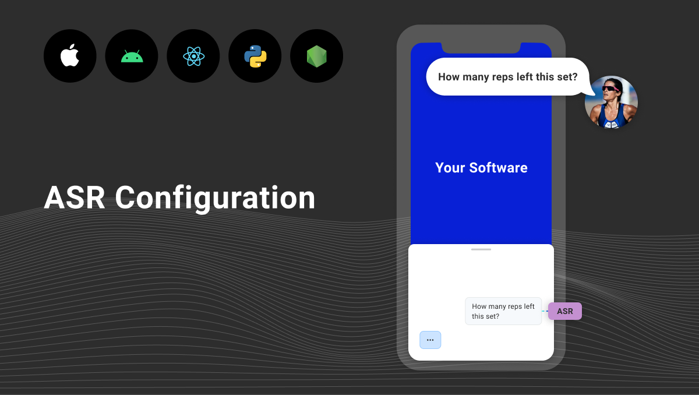

The technology for converting spoken words to text is known as automatic speech recognition (ASR).

ASR refers to the process of analyzing and transcribing a chunk of audio without human intervention. This technology is ubiquitous, with a place in the stack of every major voice assistant on the market.

In software using voice powered by Spokestack, ASR is part of the [speech pipeline](/docs/concepts/speech-pipeline).

Many different techniques have been used to accomplish this throughout ASR's [long history](https://en.wikipedia.org/wiki/Speech_recognition#History), but modern models use — what else? — neural networks. The size and performance characteristics of these models vary widely, based on where they're designed to be deployed and their intended use cases. Technology has advanced to the point where models small enough to fit on a mobile device and run in almost real time are accurate enough to use for many tasks, but models that run in the cloud are still widely used for their speed and relatively higher accuracy.

Accuracy is often measured in Word Error Rate (WER), or the percentage of words that differ between the ASR system's transcript and that of a gold-standard version. Getting an accurate WER measurement entails juggling many different variables (think accent, background noise, whether we're talking about a speech vs. a multi-party conversation, etc.), and it's [easy to spin](https://arxiv.org/abs/2010.03432). There are, however, various [academic comparisons](https://www.aclweb.org/anthology/2020.lrec-1.797.pdf) of major vendors. For perspective, human WER hovers [somewhere between 4-11%](https://www.microsoft.com/en-us/research/wp-content/uploads/2017/06/paper-revised2.pdf), depending on variables like those mentioned above, usually falling on the lower end of that range.

The Spokestack open-source native libraries provide a convenient API across multiple ASR providers such as Apple, Google, and Microsoft. Spokestack is designed to support multiple speech recognition providers so you can decide which is right for your use case. Support varies by mobile platform, however, so we decided to gather the information in one place to make the choice as easy as possible for your app.

## Supported ASR providers by platform

| Provider                                                                                                | Android  | iOS      |
| ------------------------------------------------------------------------------------------------------- | -------- | -------- |
| Android ASR (on-device)                                                                                 | &#9989;  | &#10060; |
| Apple ASR (on-device)                                                                                   | &#10060; | &#9989;  |
| Spokestack Cloud ASR                                                                                    | &#9989;  | &#9989;  |
| [Azure Speech Services](https://azure.microsoft.com/en-us/services/cognitive-services/speech-services/) | &#9989;  | &#10060; |
| [Google Cloud](https://cloud.google.com/speech-to-text)                                                 | &#9989;  | &#10060; |

## Configuration

ASR providers require various configuration, usually in the form of API keys, but sometimes runtime components. This configuration takes place when you first build a Spokestack `SpeechPipeline` (or, in newer versions, `Spokestack` object). Below is a list of configuration needed for each platform and some usage notes.

For Android, primitive configuration properties are set via a call to `setProperty(propertyName, value)` on the speech pipeline's builder (or a `SpeechConfig` object supplied to it); in iOS, they're set as fields of a `SpeechConfiguration` object.

---

#### Android ASR

##### Android

No API keys or configuration properties are required, but a Context (`android.content.Context`) object must be added to the `SpeechPipeline`'s builder via the `setAndroidContext()` method. See [the javadoc for `AndroidSpeechRecognizer`](https://www.javadoc.io/doc/io.spokestack/spokestack-android/latest/io/spokestack/spokestack/android/AndroidSpeechRecognizer.html) for more information.

###### Device compatibility

Android's native ASR support is device-dependent. For production apps targeting broad compatibility, we recommend testing for its availability by calling [`SpeechRecognizer.isRecognitionAvailable()`](<https://developer.android.com/reference/android/speech/SpeechRecognizer#isRecognitionAvailable(android.content.Context)>) and having a fallback option in place for if it returns `false`.

This chart lists physical devices on which it has been tested by either the Spokestack team or our community. If you have a device that is not listed, please try it out and submit a PR with your results!

| Device                 | API Level | ASR working? |
| ---------------------- | --------- | ------------ |
| Moto X (2nd Gen)       | 22        | &#10060;`*`  |
| Lenovo TB-X340F tablet | 27        | &#9989;      |
| Pixel 1                | 29        | &#9989;      |
| Pixel 3 XL             | 29        | &#9989;      |
| Pixel 3a               | 29        | &#9989;      |
| Pixel 4                | 29        | &#9989;      |

`*` ASR fails consistently with a `SERVER_ERROR`, which seems to indicate that the server used by the device manufacturer to handle these requests is no longer operational.

##### iOS

N/A

---

#### Apple ASR

##### Android

N/A

##### iOS

None required! &#x1F389;

---

#### Spokestack Cloud ASR

Spokestack's Cloud ASR requires requests to be signed with a Spokestack client ID and API secret. Spokestack accounts are free, and cloud-based ASR currently is as well. If you don't already have an account, you can sign up for one [here](/account/create); if you do, [log in](/account/login) to get your credentials.

##### Android

- `spokestack-id` (string): A Spokestack client ID, available in the account portal.
- `spokestack-secret` (string): A Spokestack API secret, also available in the account portal.

##### iOS

- `spokestack-id` (string): A Spokestack client ID, available in the account portal.
- `spokestack-secret` (string): A Spokestack API secret, also available in the account portal.

---

#### Azure Speech Services

##### Android

- `azure-api-key` (string): An API key valid for Azure Cognitive Services. See [Microsoft's documentation](https://azure.microsoft.com/en-us/try/cognitive-services/?api=speech-services) for more information.
- `azure-region` (string): A region identifier for Azure Speech Services. See [Microsoft's list](https://docs.microsoft.com/en-us/azure/cognitive-services/speech-service/regions).

You'll also need the following dependency in your app's `build:gradle`:

```groovy
  implementation 'com.microsoft.cognitiveservices.speech:client-sdk:1.9.0'
```

This will require you to add Microsoft's Maven repository to your top-level `build.gradle`, which implies acceptance of their license terms:

```groovy
repositories {
  // ...
  maven { url 'https://csspeechstorage.blob.core.windows.net/maven/' }
}
```

##### iOS

N/A (for now)

---

#### Google Cloud

##### Android

- `google-credentials` (string): A JSON-serialized string containing Google account credentials. See [Google's documentation](https://cloud.google.com/docs/authentication/getting-started#creating_a_service_account) for more information.
- `locale` (string): A BCP-47 language identifier to identify the language that should be used for speech recognition (example: "en-US"). See [Google's documentation](https://cloud.google.com/speech-to-text/docs/languages) for a list of supported codes.

You'll also need the following dependencies in your app's `build:gradle`:

```groovy
  implementation 'com.google.cloud:google-cloud-speech:1.22.2'
  implementation 'io.grpc:grpc-okhttp:1.28.0'
```

##### iOS

N/A (for now)
