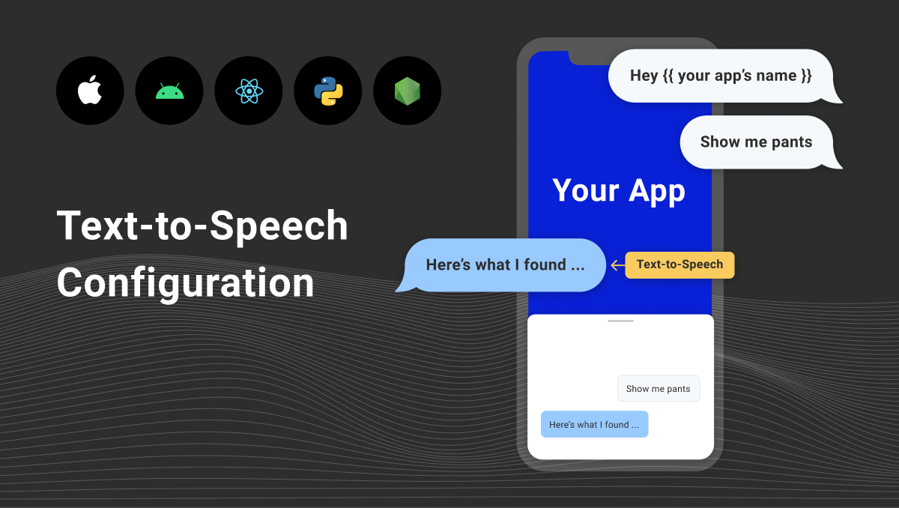

Spokestack offers a rich, controllable text-to-speech (TTS) system. The voices available to use in your app are determined by your API client identifier, but we offer a demo voice to all users so that you can try custom TTS in your app without making a commitment. If you need a unique voice for your brand, [contact us](mailto:hello@spokestack.io), and we can work with you to create a custom experience for your users.

Apart from voice selection, Spokestack's TTS enables fine control over pronunciation by supporting a subset of both the [SSML](https://www.w3.org/TR/speech-synthesis11/) standard and [Speech Markdown](https://www.speechmarkdown.org/) syntax. Synthesis defaults to using raw text, but you can opt into using one of these other markups instead; see the platform-specific documentation ([iOS](https://spokestack.github.io/spokestack-ios/Classes/TextToSpeechInput.html) | [Android](https://www.javadoc.io/doc/io.spokestack/spokestack-android/latest/io/spokestack/spokestack/tts/SpokestackTTSClient.html)) for details.

## SSML

SSML is an XML-based markup language; the root element must be `<speak>`. Aside from `speak`, Spokestack supports the following elements:

- [s](https://www.w3.org/TR/speech-synthesis11/#edef_sentence)
- [break](https://www.w3.org/TR/speech-synthesis11/#edef_break)
- [prosody](https://www.w3.org/TR/speech-synthesis11/#S3.2.4), `pitch` and `rate` attributes only
- [phoneme](https://www.w3.org/TR/speech-synthesis11/#S3.1.10) with the `alphabet` attribute set to "ipa"
- [say-as](https://www.w3.org/TR/speech-synthesis11/#S3.1.9), `interpret-as` attribute only, with one of the following values:
  - `cardinal`
  - `characters`
  - `digits`
  - `number`
  - `ordinal`
  - `spell-out`
  - `telephone`
  - `unit`

Note that long inputs should be split into separate `s` ("sentence") elements for the best performance.

Currently, Spokestack is focused on pronunciation of English words and loan words/foreign words common in spoken English and thus restricts its character set from the full range of [IPA](https://en.wikipedia.org/wiki/International_Phonetic_Alphabet) characters. Characters valid for an IPA `ph` attribute are:

```bash
 [' ', ',', 'a', 'b', 'd', 'e', 'f', 'g', 'h', 'i', 'j',
 'k', 'l', 'm', 'n', 'o', 'p', 'r', 's', 't', 'u', 'v',
 'w', 'z', 'æ', 'ð', 'ŋ', 'ɑ', 'ɔ', 'ə', 'ɛ', 'ɝ', 'ɪ',
 'ʃ', 'ʊ', 'ʌ', 'ʒ', 'ˈ', 'ˌ', 'ː', 'θ', 'ɡ', 'x', 'y',
 'ɹ', 'ʰ', 'ɜ', 'ɒ', 'ɚ', 'ɱ', 'ʔ', 'ɨ', 'ɾ', 'ɐ', 'ʁ',
 'ɵ', 'χ']
```

Using invalid characters will not cause an error, but it might result in unexpected pronunciation.

### Examples

- When you just can't give up that web prefix:

  `<speak>See all our products at <say-as interpret-as="characters">www</say-as> dot my company dot com.</speak>`

- Insert a pregnant pause:

  `<speak>Today's stock price <break time="500ms"/> fell three percent.</speak>`

- Customize pronunciation to make a point:

  `<speak>I don't care what you say; it's pronounced <phoneme alphabet="ipa" ph="gɪf">gif</phoneme>, not <phoneme alphabet="ipa" ph="dʒɪf">gif</phoneme>!</speak>`

## Speech Markdown

Speech Markdown is a convenience wrapper around SSML syntax, so Spokestack's support for it mirrors our SSML support. The structure of Speech Markdown is flatter than SSML's; support for the SSML elements above translates into the following Speech Markdown syntax:

- [break](https://www.speechmarkdown.org/syntax/break/)
- [pitch](https://www.speechmarkdown.org/syntax/pitch/)
- [rate](https://www.speechmarkdown.org/syntax/rate/)
- [ipa](https://www.speechmarkdown.org/syntax/ipa/)
- [cardinal](https://www.speechmarkdown.org/syntax/cardinal/)
- [characters](https://www.speechmarkdown.org/syntax/characters/)
- [number](https://www.speechmarkdown.org/syntax/number/)
- [ordinal](https://www.speechmarkdown.org/syntax/ordinal/)
- [phone/telephone](https://www.speechmarkdown.org/syntax/phone/)
- [unit](https://www.speechmarkdown.org/syntax/unit/)

### Examples

Here are the above SSML examples translated into Speech Markdown:

`See all our products at (www)[characters] dot my company dot com.`

`Today's stock price [500ms] fell three percent.`

`I don't care what you say; it's pronounced (gif)[/gɪf/], not (gif)[/dʒɪf/]!`
