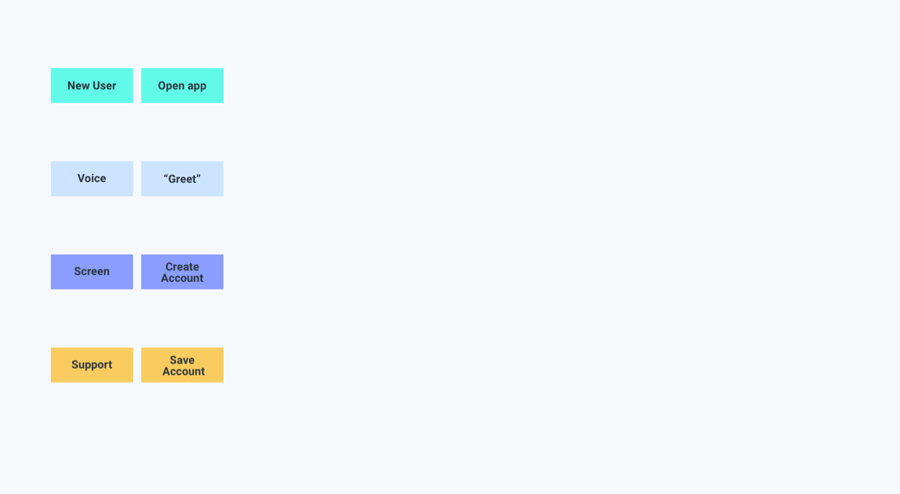
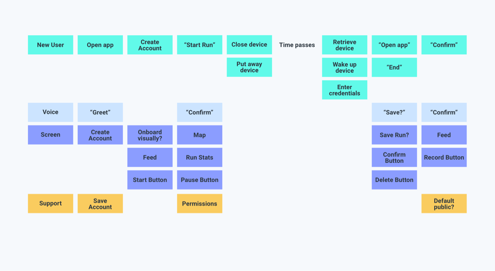

After [identifying the right use cases](find-the-right-use-case) for multimodality, map how you’ll integrate them into your app. Think about who/what you’re solving for and what users need in order to accomplish their goals. A useful technique for this is to create a customer journey or experience map.

## What _is_ an experience map?

An experience map is a list of inputs from left to right with simultaneous outputs below. Multimodal maps include inputs (verbal intents and nonverbal gestures) and outputs as well as needed contextual & supporting information. This prevents designing verbal language and nonverbal visuals in isolation. A complete map is not meant to be exhaustive, but should represent your app’s primary flow. It should also provide a better sense of scope and a more cohesive end product.

Inspiration for this exercise comes from the [Sketch Phase](https://www.thesprintbook.com/how) of _The Design Sprint_ and [How to Make an Experience Map](https://blog.carbonfive.com/2017/08/03/experience-mapping-2/).

## What are intents & utterances?

Before getting started, it’s important to understand the difference between an intent and an utterance. The term “intent” comes from the world of natural language understanding (NLU). One of the jobs of an NLU system is to listen to what a user says, take their text input, and match that text input with an intent. How a user expresses an intent is often referred to as an "utterance.”

Multiple utterances may correspond with a single intent. For example, an app that sells movie tickets will likely need to handle searches for movie titles. If a user says “I want to see 1917,” the NLU system might resolve that user’s utterance to a `SearchMovie` intent. How this input is handled can be the most important part of your design. Part of what Spokestack does is handle the tricky mapping of utterances to intents.

## List intents & their corresponding counterparts

When mapping for multimodal devices, think of inputs as either gestures or intents. Consider which actions and tasks will make users more productive and focus on these throughout the design process. A good first step is to write these down as a rough list of intents as well their corresponding counterparts. For example, apps with a `start` intent often also require `stop` and `pause` intents. Think of this as a fluid list that will help frame what you need to teach users to ask later in your script. Include things like `repeat`, `help`, `exit`, and `start over`. These are often referred to as “universal intents.” Consider including `go back`, especially if your app is instructional or task-based.

As a thought example, imagine you’re working on a fitness tracking app. Here’s a list of some intents you might include:

| Start              | Pause        | Resume         | End              |
| ------------------ | ------------ | -------------- | ---------------- |
| Save               | Cancel       | Pace           | Elapsed distance |
| Remaining distance | Elapsed time | Remaining time | Help             |
| Error              |              |                |                  |

## Actors & Actions

The type of experience map we use lists `actors` in the app along the left axis. The bottom axis represents time as an actor moves through the app. Give each actor a name and write them each on a separate sticky note in a color unique to them.

Our maps include the following actors:

| **User**    | This will include gestures and intents initiated by the user. Keep each action high-level and describe them briefly. Distinguish gestures from intents using “quotes.” For example, you could write “pace” on a sticky note to capture the following user utterance: “How fast am I running?” Write actions you’re unsure about as questions.                                                                                                 |
| ----------- | --------------------------------------------------------------------------------------------------------------------------------------------------------------------------------------------------------------------------------------------------------------------------------------------------------------------------------------------------------------------------------------------------------------------------------------------- |
| **Voice**   | This will include verbal output including prompts and responses. Again, keep these brief, use “quotes,” and write actions you’re unsure about as questions. Consider when you’ll allow the user to speak. Will they be able to interrupt? Don’t fill in actions here if you feel verbal output is unnecessary. What you record for the user and voice actors will serve as the basis for [your script](script-storyboard-responses) later on. |
| **Screen**  | This will include nonverbal visual output. Consider what visuals you’ll need to add in order to communicate listening and confirm understanding. Will you support touch-to-talk? Remember to keep these high-level. We’ll get to [best practices](tips-for-designing-visual-output) for designing these in a later section.                                                                                                                   |
| **Support** | This will include actions performed by actors not included in the top three rows (e.g. application server, customer support, and app logic).                                                                                                                                                                                                                                                                                                  |

## How to build a map

For this exercise, you’ll need sticky notes (4-6 different colors), markers, and an empty surface. Tape is optional, but recommended for sticky notes that become less adhesive throughout the exercise. Invite a variety of teammates with differing areas of expertise to your space. Designate someone to lead and record the discussion using sticky notes.

### Pick a starting point & list user actions

To accommodate all possible user journeys, most mobile apps will require multiple experience maps. Establish a starting point for each. If mapping a new app, a logical starting point might be when a new user opens the app for the first time. For an existing app, you might start when a user returns to the app for a specific reason. Create separate maps for new and return users. Consider how you’ll onboard voice to new users. For example, iOS has separate permissions for microphone & speech recognition. Android users only have to grant the `record-audio` permission.

Keep in mind how your app currently handles the same task and consider how multimodal communication might improve this experience. List user actions until you would expect something to happen on the device. Each action goes on a separate sticky note in the same color as the corresponding actor. Keep your actions platform-agnostic. For example, instead of _tap home button_, which refers to older iPhones, write _wake up device_.

#### A starting map for a new app

#### A starting app for an exising app

### Continue mapping top to Bottom, left to right

Capture high-level inputs and outputs that get the user to the next step. Don’t worry about UI specifics at this point. Document lapses in time where necessary.

Consider the following questions as you progress:

- What information do users need to successfully complete an action?
- What is your user’s next action?
- What information do they need to get them to their next action?
- Where will voice input be an alternative to button input?
- How will they know when an interaction is successfully completed?

Nothing is set in stone. That’s the beauty of using sticky notes. Move actions around until the order feels right to you. Look for any holes in the map that need further clarity.

As a thought example, we’ve provided a map for a fitness tracker. This includes a user opening our fitness tracker for the first time, creating an account, starting a run, and finishing a run. This does not include how a user would ask for their run stats. To account for this, either go back and try to fit these into your initial map or make a note to include them later in your script.

