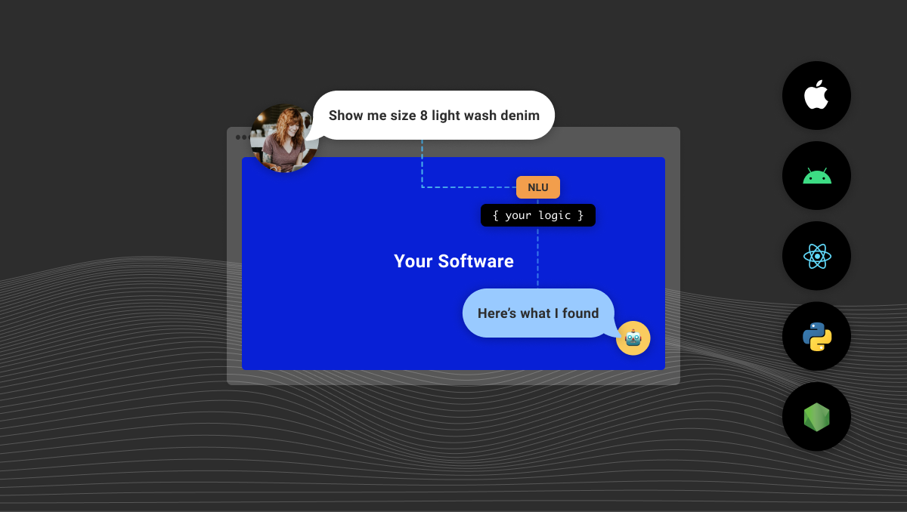

This guide details the process of exporting an existing interaction model from Alexa, Dialogflow, or Jovo for use with Spokestack.

See the documentation on [our training format](/docs/machine-learning/nlu-training-data) for a way to create a model from scratch.

## Alexa

1. Go to the [Alexa Developer Console](https://developer.amazon.com/en-US/docs/alexa/devconsole/about-the-developer-console.html).

2. Copy the contents of your [Interaction Model](https://developer.amazon.com/en-US/docs/alexa/custom-skills/create-the-interaction-model-for-your-skill.html) from the JSON Editor into a file named `{skill_name}.json`.

3. Upload `{skill_name}.json` to the [Spokestack Console](/account/services/nlu)

## Dialogflow

1. Go to the [Dialogflow Console](https://dialogflow.cloud.google.com/).

2. Choose the agent you would like to export.

3. Navigate to the agent settings (cog wheel).

4. Click the `Export and Import` tab.

5. Select `Export as zip` and save the `.zip` file.

6. Upload the `.zip` file to the [Spokestack Console](/account/services/nlu)

## Jovo

1. Add your Spokestack API key and secret to your project's configuration file.

2. Run the [`jovo build`](https://www.jovo.tech/marketplace/jovo-cli/build) command to create a `platforms/spokestack` directory.

3. Run the [`jovo deploy`](https://www.jovo.tech/marketplace/jovo-cli/deploy) command to upload your model.
