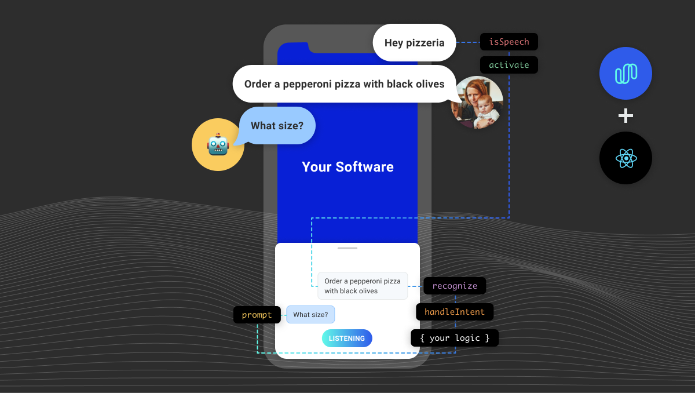

To include model files locally in your app (rather than downloading them from a CDN), you also need to add the necessary extensions so
the files can be included by Babel. To do this, edit your [`metro.config.js`](https://facebook.github.io/metro/docs/configuration/).

```js
const defaults = require('metro-config/src/defaults/defaults')

module.exports = {
  resolver: {
    // json is already in the list
    assetExts: defaults.assetExts.concat(['tflite', 'txt'])
  }
}
```

Then include model files using source objects:

```js
await Spokestack.initialize(clientId, clientSecret, {
  wakeword: {
    filter: require('./filter.tflite'),
    detect: require('./detect.tflite'),
    encode: require('./encode.tflite')
  },
  nlu: {
    model: require('./nlu.tflite'),
    metadata: require('./metadata.json'),
    vocab: require('./vocab.txt')
  }
})
```

This is not required. You can also pass remote URLs to the same config options and the files will be downloaded and cached automatically when first calling `initialize`:

```js
await Spokestack.initialize(clientId, clientSecret, {
  wakeword: {
    filter: 'https://s.spokestack.io/u/hgmYb/filter.tflite',
    detect: 'https://s.spokestack.io/u/hgmYb/detect.tflite',
    encode: 'https://s.spokestack.io/u/hgmYb/encode.tflite'
  },
  nlu: {
    model: 'https://s.spokestack.io/u/7fYxV/nlu.tflite',
    metadata: 'https://s.spokestack.io/u/7fYxV/metadata.json',
    vocab: 'https://s.spokestack.io/u/7fYxV/vocab.txt'
  }
})
```
