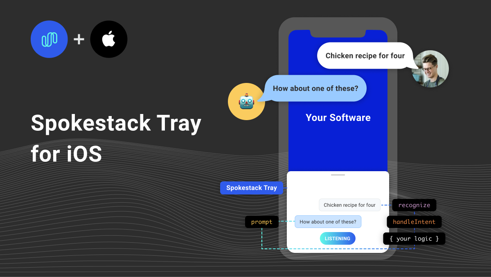

[Spokestack Tray](/docs/concepts/tray) for iOS is a SwiftUI component library that quickly and easily adds voice interaction to any iOS app. Get started from the simple [instructions on Github](https://github.com/spokestack/spokestack-tray-ios#installation)! Manage voice interactions for your app, delivering actionable user commands with the help of Spokestack Tray in just a few lines of code!

`youtube: [Spokestack Tray Demo](https://www.youtube.com/watch?v=0RBITe8RNco)`
